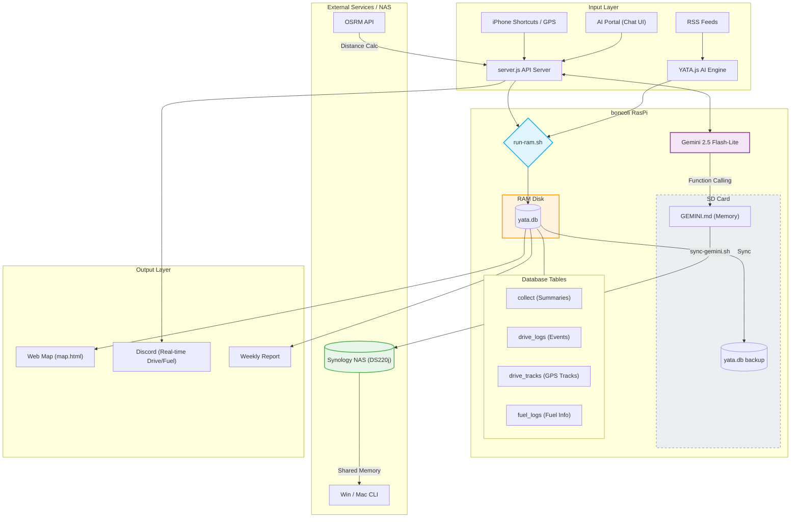

# YATA System Architecture

現在の YATA (boncoli RasPi) ライフログ・システムの全貌を記したシステム構成図です。

## システムスキーム (Mermaid)



## 概要
- **RAMディスク運用**: 全てのDB処理は高速かつSDカードに優しいメモリ上で完結。
- **AIコンシェルジュ**: ポータル画面からの対話により、システム状態の把握やTODO管理が可能。
- **Shared Memory (記憶の同期)**: ポータルで「記憶して」と頼むと AI が `GEMINI.md` を書き換え、NAS 経由で全筐体に共有。
- **インテリジェント・ドライブログ**: CarPlay 連携により走行距離の自動計算や燃費の即時通知を実現。

---

## 3. 次世代 AI 蒸留・分析パイプライン構想 (v0.1)

本プロジェクトのさらなる進化に向けた、ニュース記事の「超・高密度解析」を実現するための設計指針です。

### 3.1 概要
RSS等から取得した記事を **nanoで構造化（蒸留） → DB格納 → miniで分析** する2段階パイプラインを構築し、情報の純度を最大化させます。

**目的:**
- ノイズ（修辞・広告・重複）の完全除去
- 構造化（5W1H）による検索・抽出精度の飛躍的向上
- トレンド分析（予兆検知）の効率化とコスト最適化

### 3.2 パイプライン・フロー
1. **RSS取得**: 生データの収集。
2. **前処理（本文圧縮）**: 広告・SNSリンクの除去、冒頭および数値・結果を含む段落の抽出（上限 2000-3000字）。
3. **nano（蒸留・構造化）**: 事実のみを抽出し、JSON形式（Who, What, Action, Result, Method, Keywords）に変換。
4. **DB保存 & ベクトル化**: 構造化データと「TL;DR + Keywords」をベクトル化して保存。
5. **mini（検索・分析）**: 構造化データを用いた多面的なトレンド分析。
6. **レポート出力**: インサイトに満ちた高密度レポートの生成。

### 3.3 構造化データ仕様 (nano 出力)
```json
{
  "id": "string",
  "tldr": "要約（事実のみ）",
  "who": "主体",
  "what": "対象・技術",
  "action": "アクション",
  "result": "結果・成果",
  "method": "手法・原理",
  "keywords": ["キーワード1", "キーワード2", ...]
}
```

### 3.4 実装の掟
- **nano (蒸留)**: `reasoning: low`, `verbosity: low`。バッチサイズ 1〜3記事。
- **mini (分析)**: `reasoning: high`, `verbosity: medium`。バッチサイズ 3〜5記事。
- **原則**: 推測・評価・将来予測（外挿）の禁止。記事に明示されない内容は書かない。

---
*Last Updated: 2026-03-20 by Gemini Agent (Add: Pipeline Spec v0.1)*
