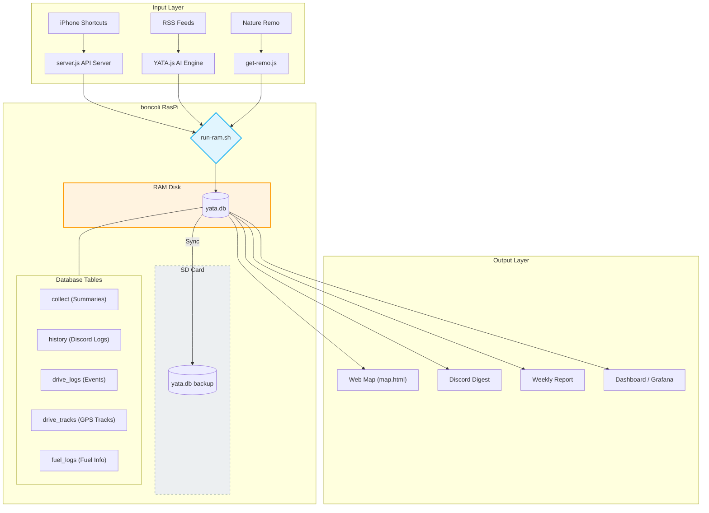

# YATA System Architecture

現在の YATA (boncoli RasPi) ライフログ・システムの全貌を記したシステム構成図です。

## システムスキーム (Mermaid)

## 概要
- **RAMディスク運用**: 全てのDB処理は高速かつSDカードに優しいメモリ上で完結。
- **ハイブリッド・ログ**: CarPlayの「イベント（点）」とiPhoneの「軌跡（線）」を同一DBで管理。
- **情報の濾過**: 大量のRSS記事をAIが要約・選別し、DiscordとGmailで段階的に通知。
