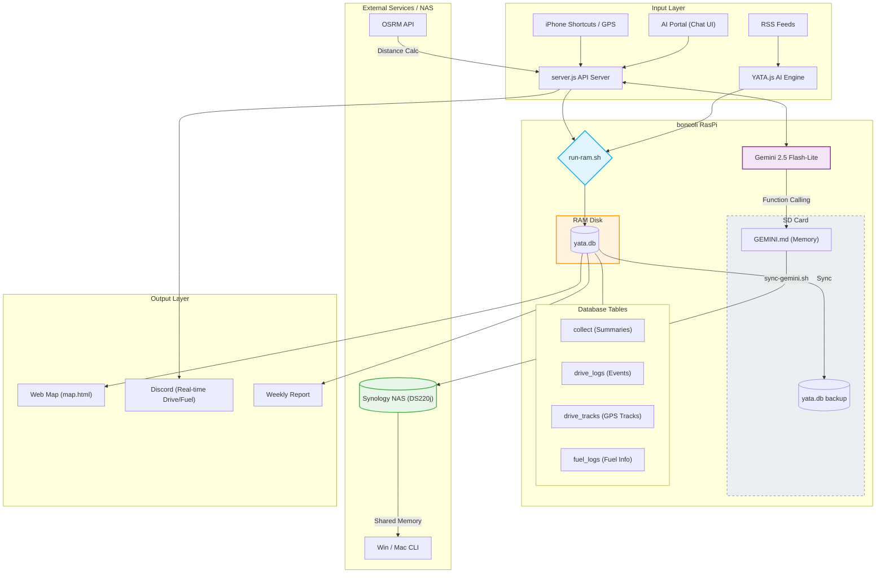

# YATA System Architecture

現在の YATA (boncoli RasPi) ライフログ・システムの全貌を記したシステム構成図です。

## システムスキーム (Mermaid)

## 概要
- **RAMディスク運用**: 全てのDB処理は高速かつSDカードに優しいメモリ上で完結。
- **AIコンシェルジュ**: ポータル画面からの対話により、システム状態の把握やTODO管理が可能。
- **Shared Memory (記憶の同期)**: ポータルで「記憶して」と頼むと AI が `GEMINI.md` を書き換え、NAS 経由で全筐体に共有。
- **インテリジェント・ドライブログ**: CarPlay 連携により走行距離の自動計算や燃費の即時通知を実現。
