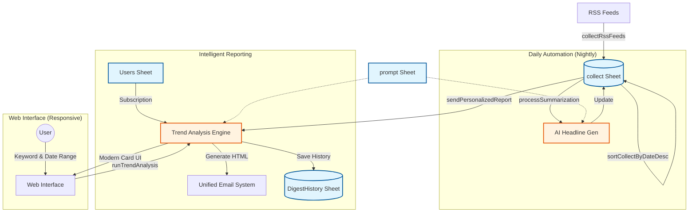

# YATA（八咫）
> **The Three-Legged Guide to the Web.**
> **あなた専属の「AIインテリジェンス・パートナー」が、情報の海から真実を映し出します。**


## ⛩️ 由来とコンセプト (Concept & Origin)

プロジェクト名 **「YATA (ヤタ)」** は、日本神話に登場する「八咫烏（ヤタガラス）」と「八咫鏡（ヤタノカガミ）」に由来します。

*   **八咫烏（三本足の導き手）**: 
    暗闇の中でも道を見失わない導きの神。本システムは **「収集」「分析」「伝達」** という3つの足（機能）を駆使し、情報の洪水の中で迷うユーザーを、正しい意思決定へと導きます。
*   **八咫鏡（真実を映す鏡）**: 
    汚れなく真実を映し出す神器。AIの力でノイズ（不要なニュース）を徹底的に削ぎ落とし、その裏に隠された **「本質（インサイト）」** だけを鮮明に映し出します。

---

## 📖 概要 (Introduction)

**YATA** は、膨大なWeb記事を自動収集し、最先端のAIがあなたの代わりに「読み」「分析」し、「重要なインサイト」だけを届けてくれる**AIインテリジェンス・プラットフォーム**です。

毎朝のニュースチェックにかける時間を **90%削減** しながら、人間では見逃してしまうような**「技術の萌芽」や「トレンドの変化」**をキャッチすることができます。

---

## 💡 特徴と提供価値 (Key Features)

### 1. 「点」から「線」へ（Trend Analysis）
過去の分析結果をシステムが記憶しています。単発のニュースとしてではなく、**時間軸での変化（先週からの進捗や停滞）**をAIがストーリーとして可視化し、週間レポートとして配信します。

### 2. 高機能 Deep Dive 検索（Advanced Search）
Web UIからキーワードを入力するだけで、直近の記事をAIが徹底分析。
*   **複合検索対応**: `(遺伝子 OR ゲノム) AND AI -倫理` のような複雑な論理演算が可能。
*   **期間指定機能**: 調査したい期間（開始日・終了日）を自由に設定可能。
*   **全角スペース対応**: 馴染みのある全角入力でも、AIが意図を汲み取って正しくパースします。

### 3. モバイル・ファースト設計（Responsive UI）
Web UIはスマホでの操作に完全対応。移動中や現場でも、カード形式で見やすく整理された最新の技術知見を、アプリのような使い心地で閲覧できます。

### 4. 堅牢なインフラ（Reliable Engine）
*   **マルチティア・LLMフォールバック**: Azure / OpenAI / Gemini を自動で切り替え、API障害時も停止しません。
*   **スマート・ウェイト機能**: 相手サーバーの負荷を考慮し、サイトの特性に合わせて巡回速度を動的に調整します。

---

## 🛠️ 技術仕様 (Technical Specifications)

### 1. システム・アーキテクチャ



### 2. プロジェクト構造

```text
YATA/
├── Index.html           # Web UI (レスポンシブ・検索インターフェース)
├── YATA.js              # メインロジック (収集, 分析, 配信, ユーティリティ)
├── README.md            # ドキュメント
└── ...
```

### 3. 主要モジュール

| モジュール名 | 役割・ロジック概要 |
|---|---|
| `LlmService` | 3段階のフォールバック通信レイヤー。堅牢なJSONパース機能を搭載。 |
| `runTrendAnalysis` | 統合分析エンジン。Webとメールの両方で共通の高度な分析を実行。 |
| `sendDigestEmail` | 共通送信レイヤー。HTML/Markdown、BCC、個別/一斉送信を柔軟に制御。 |
| `isTextMatchQuery` | 高機能パーサー。括弧やNOT演算子を含む検索クエリを解析。 |

---

## ⚙️ セットアップ手順 (Setup)

### 1. スプレッドシートの準備
以下のシートを持つスプレッドシートを作成してください。
*   `RSS`, `collect`, `Keywords`, `prompt`, `DigestHistory`, `Users`

### 2. スクリプトプロパティの設定
`OPENAI_MODEL_MINI`, `GEMINI_API_KEY`, `AZURE_ENDPOINT_URL_MINI` 等、LLM利用に必要な環境変数を設定してください。

### 3. トリガーの設定
*   `runCollectionJob`: 1〜4時間ごと
*   `runSummarizationJob`: 4〜6時間ごと
*   `sendPersonalizedReport`: 毎日 朝8時

---
## 📊 監視レイヤー構成
YATAは以下の 5つの情報レイヤー を24時間体制で監視しています。

1.  **🤖 AI Core**: Google Research, NVIDIA, Hugging Face 等
2.  **🧬 Bio-IT**: Bioinformatics, Nature Computational Science 等
3.  **🔬 Academia**: Nature/Science, bioRxiv, medRxiv 等
4.  **🏥 Clinical**: Clinical Lab Products, MedTech Intelligence 等
5.  **💼 Business**: Fierce Biotech, FDA Updates 等

---
## 🤝 Contribution
Bug reports and pull requests are welcome on GitHub at https://github.com/Boncoli/YATA.