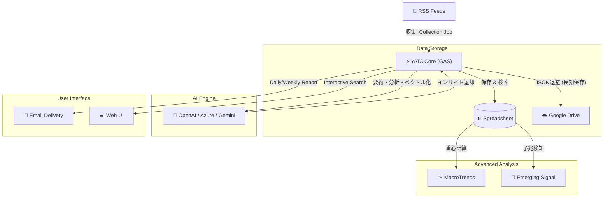

# YATA (八咫) - AI Intelligence Grimoire 🐦‍⬛🪞

> **The Three-Legged Guide to the Web.**
> **情報の海を導き、真実を映し出す。Google Apps Script (GAS) 上で完結する、あなたのための「AIインテリジェンス・パートナー」。**

[]()
[]()
[]()

本書は、完全サーバーレスで動作するAI駆動型RSS収集・分析プラットフォーム「YATA」の全貌を記したマスターマニュアル（虎の巻）である。システムの全体像、日々の運用、緊急時の対応までを網羅する。

### 🔰 誰でも嬉しい基本機能
* **完全自動のニュースキュレーション**: 登録したRSSから最新記事を自動収集。重複やノイズは自動で排除します。
* **AIによるサマリー生成**: 長い記事や英語の論文も、AIがサクッと日本語で要約してくれます。
* **毎朝のパーソナライズメール**: キーワードを指定しておけば、あなたの関心にドンピシャな記事だけを集めた日刊/週刊レポートが届きます。
* **サーバー代ゼロ**: GAS上で動くため、インフラ費用は無料（AIのAPI利用料のみで稼働します）。

---

## 🧠 Under the Hood (変態的アーキテクチャの全貌)
YATAの真髄は、GAS（実行時間6分・メモリ制限・セル数制限）と、不安定なWeb環境という「過酷な制約」をハックし尽くした裏側のロジックにあります。エンジニアが唸るマニアックな実装の一部を紹介します。

### 1. 極限のGASメモリ最適化 (Lazy Loading)
数万件のデータを扱う際、全件を読み込むとGASは即座にクラッシュします。YATAのAI要約・ベクトル生成ロジックは、**まず「日付列（A列）」だけを1次元配列として取得**して対象範囲の行数を特定し、必要な行数だけをメモリに展開する「スマート読み込み」を実装しています。

### 2. 自作ASTベースのBoolean検索エンジン
GAS上で高度なフィルタリングを実現するため、正規表現の組み合わせに逃げず、`AND` `OR` `NOT` やカッコ `()` による優先順位付けを正しく評価する**再帰的下向き構文解析（ASTベースのパーサー）**を自前で実装しています。

### 3. Map-Reduce型バッチ要約アルゴリズム
大量のニュースを1回のLLMリクエストに詰め込むとコンテキスト溢れ（Token Limit）を起こします。YATAは記事群をチャンク（塊）に分割して「中間要約」を並列生成し、最後にそれらを統合して「最終ダイジェスト」を生成する、堅牢なMap-Reduce型処理を採用しています。

### 4. ヒューリスティックスコアと執念の重複排除
* **指数関数的減衰スコアリング**: 記事の重要度は、単なるキーワードのヒット数だけでなく `Math.exp(-daysOld / 7)` という減衰関数（Freshness Decay）を用いて、「時間の経過とともに価値が落ちる」様子を数学的にモデリングしてスコア化しています。
* **タイトル指紋化 (Fingerprinting)**: 記事の重複判定では、全角/半角の揺れや記号の違いを正規表現で極限まで削ぎ落とし「指紋化」することで、メディア側で微修正されたタイトルでも同一記事として確実に弾きます。

### 5. スプレッドシート延命処理 (Vector Quantization)
AIが生成する1536次元のベクトル（浮動小数点）をそのまま保存すると、スプレッドシートの文字数制限にすぐ到達します。YATAは保存時に**「小数点以下6桁」に量子化（丸め処理）**を行い、検索精度を維持したままデータ容量を約50%削減しています。

### 6. 執念のスクレイピング機構 (Regex Fallback & Round-Robin)
* **ドメイン分散アクセス**: 同一サイトへの連続アクセスによるIPバンを防ぐため、収集URLをドメインごとにグループ化し、**ラウンドロビン方式**で並び替えてからリクエストを送信します。
* **ストライクシステム**: 404や503を連発する死んだフィードは、`PropertiesService` を使ったキャッシュに記録。3回連続でエラーになったフィードは**自動的にブラックリスト入り**し、無駄な通信時間を削減します。
* **正規表現フォールバック**: 閉じタグ忘れなど、XML構造が壊れているポンコツRSSに遭遇した場合、`XmlService` のエラーを検知して**即座に正規表現モードへ移行**。タグの隙間から強引にタイトルとリンクを抽出します。

### 7. AIのポンコツ対応 & マルチLLMルーティング
* **自己修復JSONパーサー**: LLMがMarkdownのコードブロック（```json）をつけてきたり、出力が途切れて閉じカッコ `}` を忘れたりしてもエラーにしません。正規表現で無理やり中身を抜き出す自己修復ロジックを搭載しています。
* **自動フォールバックと精密なコスト管理**: Azure OpenAI、OpenAI、Geminiを透過的に扱い、一方が死んでも自動で切り替えます（Serial Fallback）。さらに、文字数と利用モデルから**消費コスト（ドル）を独自計算してプロパティに記録・集計**する予算管理機能まで内蔵しています。

### 8. 記憶の永続化とステートフルリカバリ
* **連想記憶 (Associative Memory)**: 過去のレポートをAIがさらに「圧縮コンテキスト」に変換し、ベクトル化して保存。検索時にキーワードが一致しなくても、ベクトル類似度から「文脈の近い過去の履歴」を引っ張り出してレポートに反映します。
* **動的期間リカバリ**: メールの自動送信ジョブがエラーで落ちた場合でも、ユーザーごとに「前回いつ送信に成功したか」をプロパティに記録しているため、次回のジョブ起動時に**未送信だった日数を自動計算して期間を拡張**し、抜け漏れなくリカバリします。

### 9. 究極のGASパフォーマンスチューニング (In-Memory Caching & APM)
GAS特有の重いAPI呼び出し（`SpreadsheetApp.openById`）を回避するため、グローバル空間にシングルトンのキャッシュオブジェクト（`_SsCache`）を構築し、呼び出しコストをゼロ化。さらに、全RSSフィードのミリ秒単位の応答速度を計測し「遅延ワーストランキング」を出力するAPM（パフォーマンス監視）ツールまで内蔵しています。

### 10. GPT-5推論モデル対応とAIパーソナリティの動的制御
タスクに応じてLLMの「温度（Temperature）」を動的に変更（事実抽出は0.0、予兆検知は0.7など）。さらに、o1/o3やGPT-5等の最新モデルで要求される推論深度（`reasoning_effort`）や冗長性（`verbosity`）の制御プロパティまでネイティブ実装しており、次世代LLMのパラダイムシフトに完全対応しています。

### 11. LLM前処理としての LanguageApp 活用 (Token Saving)
記事のタイトルや短い抜粋を処理する際、無駄にLLMのAPIを叩いてコストを消費しないよう、まず `isLikelyEnglish` でテキストの言語を判定。英語であればGAS標準の無償APIである `LanguageApp.translate` を使って事前翻訳を済ませるという、極限のAPIコスト節約術が組み込まれています。

### 12. 動的スクレイピング & オンデマンドサマライザー
ユーザーが任意のURLの要約を求めた際 (`getWebPageSummary`)、Bot弾きを回避するためのヘッダー偽装を行いつつ対象ページをフェッチ。正規表現でHTMLから本文テキストだけを大まかに抽出し、上限3万文字でカットしてからLLMに「プロの編集者としての解説」を要求する、自律的なオンデマンドスクレイパーを内蔵しています。

### 13. Native Dimensionality Reduction (256次元圧縮)
最新の Embedding モデル (`text-embedding-3-small`) のネイティブ機能を活用し、保存時のベクトルを 1536次元から **256次元** へと劇的に圧縮。精度劣化を 2% 未満に抑えつつ、保存容量（GASの1セル文字数制限）を従来の 1/6 にまで削減しました。これにより後述の「ダブルベクトル運用」が可能になりました。

### 14. Method Embedding (2nd Vectorization)
「何について書かれているか（Topic）」に加えて、「どうやって測定・実験したか（Method/Modality）」という異なる軸でのベクトル化を同時に行います。これにより、異分野間で同じ手法が使われ始めたという、表面的なトピック検索では見落としがちな「真の予兆（Emerging Signal）」を検知する多次元的なインテリジェンスを実現しています。


---

## ⛩️ Concept: 三本足の導き手

名前の由来は、日本神話の「八咫烏（ヤタガラス）」と「八咫鏡（ヤタノカガミ）」。

1.  **収集 (Collection)**: 広大なWebから鮮度の高い情報を掴む足。並列処理による高速RSS巡回。
2.  **分析 (Analysis)**: 本質を見抜き、過去からの文脈を紡ぐ足。LLMによる要約と予兆検知。
3.  **伝達 (Dispatch)**: 必要な時に、必要な形（メール/Web）で届ける足。パーソナライズされたインサイト。

---

## 🏗️ System Architecture (全体像)
YATAは「サーバーレス」かつ「ポータブル」な設計思想に基づき、Google Workspace (GAS + Sheets) 上で完結して動作する。



---

## 🚀 Getting Started (導入手順)

YATAをあなたの環境で動かすための手順です。

### Step 1: スプレッドシートの準備
データの保存先となるスプレッドシートを作成し、以下の名前でシートを用意します。（セキュリティの観点から「公開用(データ)」と「非公開用(設定)」の2つのファイルに分けることを推奨します）

**1. 公開用データシート** (IDを `DATA_SHEET_ID` に設定)
* `RSS` (A列: サイト名, B列: RSS URL)
* `collect` (収集した生データとベクトルが格納されます)
* `MacroTrends` (長期トレンドの重心記録用)

**2. 非公開用設定シート** (IDを `CONFIG_SHEET_ID` に設定)
* `Users` (配信先設定。Name, Email, Day, Keywords, Semantic(TRUE/FALSE))
* `Keywords` (観測したいキーワード設定)
* `prompt` (LLMに渡すプロンプトテンプレート)
* `DigestHistory` (AIの要約履歴)

### Step 2: GASプロジェクトの作成とコード配置
1. Google Driveから「Google Apps Script」の新規プロジェクトを作成します。
2. リポジトリの `YATA.js` の内容を `コード.gs` に貼り付けます。
3. （必要に応じて、Web UI用の `Index.html`, `Visualize.html` 等を追加します）。

### Step 3: スクリプトプロパティ（環境変数）の設定
後述の「🛠️ Setup & Maintenance」を参照し、GASエディタの歯車マークから必要なIDやAPIキーを登録してください。

### Step 4: トリガー（定期実行）の設定
後述の「⏱️ Recommended Trigger Settings」を参照し、スケジュールを設定してください。

---

## 🚀 Key Features (主要機能詳細)

### 1. インテリジェント・モニタリング
* **重複排除 & ボット対策**: URL正規化とタイトル一致確認により重複記事を徹底排除。ランダム待機とUser-Agent偽装、ドメイン分散アクセスで安定収集。
* **多層監視**: 技術、ビジネス、論文など、登録されたあらゆるRSSソースを24時間監視。

### 2. 予兆（サイン）検知：Emerging Signal Engine
* **マジョリティからの乖離**: 現在のトレンド重心から数学的に離れた「異質な記事」を検出。
* **核形成 (Nucleation)**: 異なるソースで同時に語られ始めた「小さなシグナル」を特定し、将来のトレンドを予測。

### 3. ハイブリッド検索
* **Semantic Search (意味検索)**: ベクトル埋め込み (Embedding) により、キーワードが一致しなくても「文脈」が近い記事をヒットさせる。
* **Advanced Query**: AND/OR/NOT やカッコを使った複雑な論理検索が可能。

### 4. パーソナライズド・レポート
* **自動配信**: ユーザーの設定に応じ、日刊（毎朝）または週刊（指定曜日）でレポートを自動生成。
* **コンテキスト認識**: 過去の履歴を参照し、「先週からの進展」を含めたストーリーのあるレポートを生成。

### 5. Long-term Archiving (長期トレンド保存) 【v3.3.0 New】
* **自動アーカイブ & 軽量化**: 3ヶ月を経過したデータは自動的にJSON化してGoogle Driveへ退避。スプレッドシートを常に軽量に保つ。
* **MacroTrends**: 生データの代わりに「その月のトレンド重心（ベクトル平均）」と「要約」を記録し、数年単位の話題変遷を追跡可能にする。

### 6. Enterprise-Grade Security 【v3.3.0 New】
* **完全なID分離**: 記事データ（公開用）と設定データ（非公開用）を物理的に別ファイルで管理。
* **シークレット管理**: APIキーやID類をすべてスクリプトプロパティに隠蔽。

### 7. Interactive UI & On-Demand Summary 【UX Enhancement】
* **オンデマンドAI要約**: レポート内やWeb UI上の「⚡ AI要約」ボタンを押すと、バックエンドでGASが対象Webページをスクレイピングし、その場でLLMが300文字の解説記事を生成してポップアップ表示します。
* **リッチ・タイポグラフィ**: AIが生成したテキスト内の `[進展]` `[懸念]` といったステータスタグを検知し、美しいCSSバッジに自動変換。キーワードに応じたアイコン（📝, 🧐, 🏆）も自動付与され、視認性の高いカード型レポートを出力します。

---

## 🗓️ User Workflow (利用者の体験)

### 1. 朝のインサイト (Daily Routine)
* **07:00 (収集)**: YATAが寝ている間に世界のニュースを収集し、重複を排除。
* **07:30 (分析)**: AIが全記事を読み込み、「事実」だけを抽出して要約。
* **08:00 (配信)**: あなたのメールボックスに「今日知るべきこと」だけが届く。

### 2. 深掘りと探索 (Deep Dive)
* 気になったトピックがあれば、**Web UI** にアクセス。
* 「直近1ヶ月」×「意味検索」で、関連する過去の動きを一気に洗い出す。

---

## 📖 Configuration Guide (設定マニュアル)

### 1. 検索クエリの書き方

`Keywords` シートや `Users` シートでは、以下の演算子が使用可能です。

| 検索タイプ | 記法例 | 説明 |
| :--- | :--- | :--- |
| **AND検索** | `AI 医療` | 両方の単語を含む (スペース区切り) |
| **OR検索** | `Python OR Ruby` | いずれかの単語を含む (**大文字**指定) |
| **NOT検索** | `Apple -Fruit` | Appleを含み、Fruitを**含まない** |
| **複合** | `(EV OR 電気自動車) -テスラ` | カッコで優先順位を指定可能 |

### 2. シート設定の仕様

#### 👥 Users シート (配信設定) -> [非公開ファイル]

| 列 | 項目名 | 設定値の例 | 説明 |
| :--- | :--- | :--- | :--- |
| A | Name | John Doe | ユーザー名 |
| B | Email | user@example.com | 配信先 |
| C | Day | `月` / `(空欄)` | `空欄`=毎日、`曜日`=週1回配信 |
| D | Keywords | `AI, 半導体` | 関心キーワード(カンマ区切り) |
| E | Semantic | `TRUE` | `TRUE`でAI意味検索を有効化 |

#### 🔑 Keywords シート (定点観測) -> [非公開ファイル]

| 列 | 項目名 | 説明 |
| :--- | :--- | :--- |
| A | Query | 検索クエリを入力 |
| B | Flag | `TRUE` で有効化 |
| D | Label | レポート用短縮名 |

---

## 🛠️ Setup & Maintenance (管理者向け)

### 1. 必須環境変数 (Script Properties)

[プロジェクト設定] > [スクリプトプロパティ] に以下を設定してください。

#### 🛡️ Infrastructure

| プロパティ名 | 説明 |
| :--- | :--- |
| `DATA_SHEET_ID` | **[公開]** データ収集用シートID |
| `CONFIG_SHEET_ID` | **[非公開]** 設定管理用シートID |
| `ARCHIVE_FOLDER_ID` | **[保存先]** アーカイブ用ドライブフォルダID |
| `MAIL_TO` | 管理者メールアドレス |
| `MAIL_SENDER_NAME` | メール送信者名 (例: YATA Bot) |

#### 🧠 AI Engine

| プロパティ名 | 説明 |
| :--- | :--- |
| `EXECUTION_CONTEXT` | `COMPANY` or `PERSONAL` |
| `OPENAI_API_KEY` | Azure OpenAI Key |
| `OPENAI_API_KEY_PERSONAL` | OpenAI Key (Fallback) |
| `AZURE_ENDPOINT_URL_MINI` | Azure Endpoint (GPT-4o等) |
| `AZURE_EMBEDDING_ENDPOINT` | Azure Embedding Endpoint |

### 2. シート構成 (Sheet Structure)

ファイルの役割分担は**「事実 (Raw Data) の公開」**と**「戦略 (Intelligence) の秘匿」**に基づいています。

#### 📂 公開用ファイル (Data Sheet)
**ID**: `DATA_SHEET_ID`
純粋な情報ソースと統計データのみを配置します。

* **`RSS`**: 収集対象フィード一覧
* **`collect`**: 収集データ (Raw Data)
* **`MacroTrends`**: 長期トレンドの重心記録 (Meta Data)

#### 🔒 非公開用ファイル (Config Sheet)
**ID**: `CONFIG_SHEET_ID`
組織の関心事項、ユーザー情報、AIの分析履歴など、戦略的な情報を配置します。

* **`Users`**: ユーザー管理と配信設定
* **`Keywords`**: 観測キーワード（ウォッチリスト）
* **`prompt`**: LLMへの指示書
* **`DigestHistory`**: 過去の分析履歴（前回との差分比較用）
* **`Memo`**: 開発者用メモ

---

## 🛠️ Developer & Maintenance Tools (開発・運用ツール群)

YATAには、日々の運用保守やトラブルシューティングを劇的に楽にするための「隠しコマンド（ツール関数）」が大量に実装されています。スクリプトエディタから手動で実行してください。

### 🔍 1. 診断・デバッグ系 (Diagnostics)
APIの不調や、RSSの取得漏れなどの原因究明に使います。

* **`diagnoseRssLatency()`**
  * **機能**: 全RSSフィードの「応答速度（ミリ秒）」を計測し、遅延ワーストランキングTop10を出力します。
  * **用途**: GASの6分タイムアウトの元凶となっている「重いサイト」を炙り出し、リストから除外するのに使います。
* **`testAllRssFeeds()`**
  * **機能**: 登録された全RSSのパーステストを実行。「成功」「空フィード（正常）」「失敗」に分類し、失敗理由（HTMLが返ってきた、等）をレポートします。
  * **用途**: 定期的な死活監視。「最近ニュースが少ないな？」と思った時に回します。
* **`debugRssFeed()`**
  * **機能**: コード内の `TEST_URL` に指定した特定のRSSを詳細にパースし、XMLの構造や取得できたデータをログに出力します。
  * **用途**: 新しく追加したいRSSが、YATAのパーサーで正しく読めるかの事前テストに。
* **`debugLlmConnection()`** / **`testAzure_Nano()`, `testAzure_Mini()`**
  * **機能**: LLM（Azure / OpenAI / Gemini）への疎通確認を行います。
  * **用途**: 「API Error」が出た際、APIキーが死んだのか、エンドポイントが間違っているのかを切り分けます。
* **`debugPersonalReport()`**
  * **機能**: 指定したキーワードでレポートを生成し、管理者（`MAIL_TO`）だけにテスト送信します。この時、**AIの履歴（DigestHistory）は汚しません**。
  * **用途**: プロンプトの調整や、レポートのデザイン確認を本番データに影響を与えずに行いたい時に。
* **`sendTestEmail()`**
  * **機能**: 実行者のアカウントから管理者宛にシンプルなテストメールを送ります。
  * **用途**: 初回セットアップ時のGmail APIの権限（スコープ）確認用。

### 🧹 2. メンテナンス・軽量化系 (Maintenance & Optimization)
スプレッドシートの容量限界（セル数制限）との戦いを制するためのツール群です。

* **`archiveAndPruneOldData()`**
  * **機能**: 規定の月数（デフォルト6ヶ月等）を過ぎた古い記事をJSON化してGoogle Driveへ退避し、シートから削除します。同時に、その期間の「ベクトル重心」と「要約」を `MacroTrends` シートに記録します。
* **`maintenanceLightenOldArticles()`**
  * **機能**: 1ヶ月以上前の記事の「ベクトルデータ（G列）」だけを削除します。
  * **用途**: 記事自体は残してキーワード検索の対象にしつつ、クソデカ配列であるベクトルだけを消してシート容量を劇的に回復させます。
* **`maintenanceRoundExistingVectors()`**
  * **機能**: 既に保存されているベクトルを走査し、小数点以下が7桁以上あるものを「6桁」に丸め直します。
  * **用途**: 過去バージョンのYATAで保存された無駄に高精度なベクトルを圧縮し、容量を空けます。
* **`maintenancePruneDigestHistory()`**
  * **機能**: `DigestHistory`（過去のAI要約履歴）から、保存期間（デフォルト120日）を過ぎた古いコンテキストを削除します。
* **`removeDuplicates()`**
  * **機能**: URLを正規化（`normalizeUrl`）して比較し、シート内の重複記事を上から順に削除します。

### 🩹 3. データ修復・リカバリ系 (Data Repair & Recovery)
AIの気まぐれによる出力ミスや、過去データの再利用を行うためのツールです。

* **`toolFixEnglishSummaries()`**
  * **機能**: 「日本語が含まれていない要約（＝AIが英語で出力してしまった事故）」を検知し、並列処理でLLMに再要約させ、ベクトルも作り直します。
  * **用途**: プロンプトを無視して英語で返してきたポンコツAIの尻拭いを全自動で行います。
* **`clearEnglishSummaries()`**
  * **機能**: 英語の要約を検知し、一括で「空欄」に戻します（再要約はせず、次回のジョブに任せます。API節約用）。
* **`backfillVectors()`**
  * **機能**: 「要約はあるがベクトルがない」記事を探し出し、一括でベクトルを付与します。
* **`toolBackfillHistoryVectors()`**
  * **機能**: `DigestHistory` の過去データにベクトルを付与します。
  * **用途**: 連想記憶エンジン（ベクトル検索）を実装する前の古い履歴データも、意味検索の対象にアップグレードします。
* **`toolExportArchivesToSheet()`**
  * **機能**: Google Driveに退避した過去のJSONアーカイブをすべて読み込み、`Restored_Archive` という新しいシートに展開して復元します。
  * **用途**: 過去数年分のデータを一気に分析し直したい時のための「時戻し」魔法。
* **`resetAllRssStrikes()`**
  * **機能**: エラー連発でブラックリスト入りしたRSSのストライクカウント（PropertiesService内のキャッシュ）を全リセットします。
  * **用途**: 配信元のサーバーが復旧した際などに、再び巡回対象に戻します。

### 🧪 4. テスト系 (Testing)
* **`runAllTests()`**
  * **機能**: 設定の妥当性、検索ロジック（AND/OR/NOT）、スコア計算、ベクトル類似度計算、JSON自己修復、RSS正規表現フォールバック、予兆検知エンジンの全ユニットテストを一括実行します。
  * **用途**: コードを改修した際、既存のロジックが壊れていないかを確認する「回帰テスト」として必ず実行してください。

---

## ⏱️ Recommended Trigger Settings (推奨トリガー設定)

システムの安定稼働とAPIコストの最適化のため、以下のスケジュールでのトリガー設定を推奨します。

| 実行関数 | 推奨頻度 | 役割 |
| :--- | :--- | :--- |
| **`jobDispatcher`** | **30分おき** | 時間帯（前半/後半）を判別し、収集ジョブと要約ジョブを安全に振り分けて実行します。 |
| **`runEmergingSignalJob`** | **1日1回 (深夜)** | その日のトレンド重心を計算し、予兆（サイン）を検知してレポートを送信します。 |
| **`sendPersonalizedReport`** | **1日1回 (朝8時等)** | ユーザーごとの関心に基づいたパーソナライズAIレポートを配信します。 |

---

## 🚑 Troubleshooting & Limits

### トラブルシューティング

| 症状 | 対処法 |
| :--- | :--- |
| **メールが届かない** | `Apps Script`管理画面で「実行数」を確認。エラーログをチェック。 |
| **「API Error」** | APIキーの期限切れやクレジット不足を確認。プロパティを更新。 |
| **収集が止まる** | 特定のRSSがタイムアウトしている可能性。`testAllRssFeeds`で特定し無効化。 |
| **検索画面エラー** | コード修正後は必ず「新しいデプロイ」を作成し、URLを更新すること。 |

### 運用コストと制限 (目安)

* **APIコスト**: Daily $0.05 - $0.20 (GPT-4o-miniメイン運用時)
* **GAS制限**: 実行時間 6分/回、メール送信 100通/日 (無料版)

---

## 📜 History / Changelog

| Version | Date | Key Updates |
| :--- | :--- | :--- |
| **v3.8.0** | 2026-03-05 | **Dual Vectorization & Dimensionality Reduction**<br>「手法・原理」に特化した第2のベクトル生成 (Method Embedding) の導入。256次元へのネイティブ圧縮による容量削減 (1/6)。ヘルスケアデータ統合の SQLite 堅牢化。 |
| **v3.6.0** | 2026-02-25 | **Extreme Performance Optimization & GPT-5 Tuning**<br>シートアクセスをゼロ化するグローバルキャッシュ (`_SsCache`) の導入、ベクトルデータ生成と検索のバッチ化・事前パース化による超高速化。英語出力の自動検知・一括修正ツールの実装。 |
| **v3.5** | 2026-01-16 | **Refactoring & Resilience Update**<br>収集ジョブの二重実行防止(LockService)、AI要約エラーの分類処理(恒久/一時)、APIコスト保存の高速化(Batch Save)。 |
| **v3.4.0** | 2026-01-10 | **UI/UX Enhancement**<br>3Dベクトル可視化(Visualize.html)、レポート内「AI要約ボタン」実装、バッジデザイン刷新。 |
| **v3.3.2** | 2026-01-05 | **Sustainability Optimization**<br>データライフサイクルの再定義（30日でベクトル軽量化、60日で完全削除）、予兆検知の分析期間を30日に延長。 |
| **v3.3.1** | 2026-01-05 | **Optimization & Resilience**<br>ベクトルデータの軽量化(小数点丸め)による容量削減、RSSパース失敗時の正規表現フォールバック実装。 |
| **v3.3.0** | 2026-01-05 | **Archiving & Security**<br>長期アーカイブ機能(JSON退避+重心記録)、RSS収集の安全性向上(Bot判定回避)、設定値の完全外部化(AppConfig/Properties)。 |
| **v3.2.0** | 2026-01-02 | **Logic & Config Refinement**<br>ベクトル生成精度向上(翻訳ロジック改善)、検索クエリ優先順位修正(AND>OR)、設定値(AppConfig)の集約化。 |
| **v3.1.0** | 2025-12-29 | **Performance & Scale Update**<br>RSS収集の並列化、レポート生成の高速化、AI意味検索のメモリ最適化。 |
| **v3.0.0** | 2025-12-27 | **Emerging Intelligence Edition**<br>「予兆（サイン）検知」エンジン搭載。核形成 (Nucleation) の数学的検知。 |
| **v2.5.0** | 2025-12-25 | **Semantic Search**<br>ベクトル検索 (Embedding) 実装。ハイブリッド検索対応。 |

---

## 🤖 AI Declaration
本プロジェクトのソースコード（`lib/YATA.js`等）およびドキュメントは、開発者（ヒト）によるアーキテクチャ設計と検証のもと、生成AI（Gemini, GPT等）をコーディング・パートナーとして活用して記述・リファクタリングされています。

## ⚖️ License
This project is licensed under the Creative Commons Attribution-NonCommercial 4.0 International License (CC BY-NC 4.0).
You are free to share and adapt the material, but you may **NOT** use it for commercial purposes.
See the [LICENSE](LICENSE) file for details.

---

**YATA Project** - *Illuminating the unseen paths of information.*