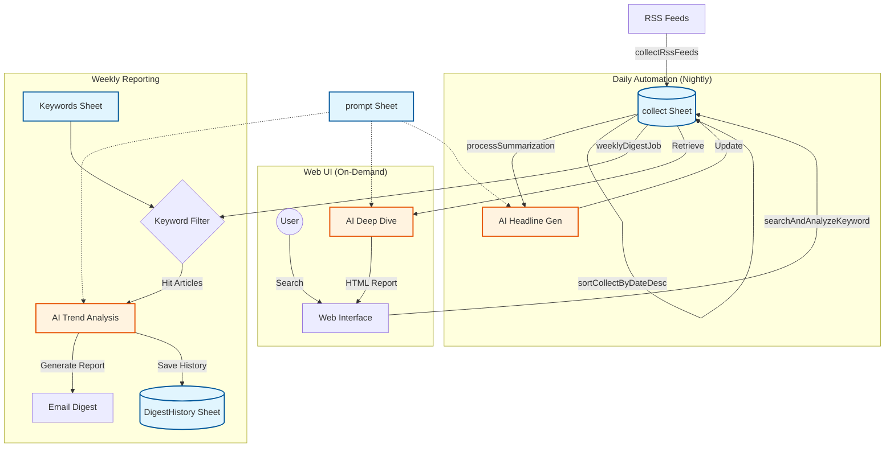

# YATA（八咫）
> **The Three-Legged Guide to the Web.**
> **あなた専属の「AIリサーチャー」が、情報の海から「真実」を映し出します。**


## ⛩️ 由来とコンセプト (Concept & Origin)

プロジェクト名 **「YATA (ヤタ)」** は、日本神話に登場する「八咫烏（ヤタガラス）」と「八咫鏡（ヤタノカガミ）」に由来します。

*   **八咫烏（三本足の導き手）**: 
    暗闇の中でも道を見失わない導きの神。本システムは **「収集」「分析」「伝達」** という3つの足（機能）を駆使し、情報の洪水の中で迷うユーザーを、正しい意思決定へと導きます。
*   **八咫鏡（真実を映す鏡）**: 
    汚れなく真実を映し出す神器。AIの力でノイズ（不要なニュース）を徹底的に削ぎ落とし、その裏に隠された **「本質（インサイト）」** だけを鮮明に映し出します。

私たちは、単なるツールではなく、プロフェッショナルの傍らに寄り添う「知性」としての存在を目指しています。

---

## 📖 概要 (Introduction)

**YATA** は、膨大なWeb記事を自動収集し、最先端のAIがあなたの代わりに「読み」「分析」し、「重要なインサイト」だけを届けてくれる**インテリジェンス・プラットフォーム**です。

毎朝のニュースチェックにかける時間を **90%削減** しながら、人間では見逃してしまうような**「技術の萌芽」や「トレンドの変化」**をキャッチすることができます。

---

## 🚀 活用シナリオ (Use Cases)

### 👩‍🔬 1. 研究開発 (R&D) ・ アカデミア
*   **課題**: 毎日数百件の論文やテックブログが更新され、追いきれない。
*   **解決**: YATAにキーワードを登録しておけば、AIが関連論文だけをピックアップし、**「従来技術との違い」や「新規性」**を要約してレポートします。

### 👨‍💼 2. 経営企画 ・ マーケティング
*   **課題**: 競合他社の動きや、市場のトレンド変化を定点観測したい。
*   **解決**: 毎週指定した曜日にレポートが届きます。先週と比較して**「活動が活発化した」「ネガティブな報道が増えた」**といった文脈の変化をAIが分析します。

### 👨‍💻 3. エンジニア ・ テックリード
*   **課題**: 新しいライブラリやフレームワークのキャッチアップが大変。
*   **解決**: Web UIから検索するだけで、**直近1ヶ月のベストプラクティス記事**をAIが総ざらいし、構造化されたHTMLレポートを即座に生成します。

---

## 💡 特徴と提供価値 (Key Features)

### 1. 「点」ではなく「線」を見る（Trend Tracking）
過去の分析結果をシステムが記憶しています。単発のニュースとしてではなく、**時間軸での変化（トレンドの進捗や停滞）**をAIがストーリーとして可視化します。

### 2. インサイトに特化したスポット分析（Deep Dive）
Web UIからキーワードを入力するだけで、直近の記事60件をAIが徹底分析。`AND` / `OR` 検索に対応し、知りたい領域をピンポイントで深掘りできます。

### 3. 安全・堅牢な自動運用
*   **マルチティア・LLMフォールバック**: Azure / OpenAI / Gemini を自動で切り替え、API障害時も停止しません。
*   **タイムアウト保護**: GASの実行時間制限を監視し、処理の全ロスを防ぐセーフティバルブを搭載。
*   **自己修復エンジン**: XMLの不正タグを自動除去してパースする、強力な収集機能を備えています。

---

## 🛠️ 技術仕様 (Technical Specifications)

### 1. システム・アーキテクチャ



### 2. プロジェクト構造

```text
YATA/
├── Index.html           # Web UI (検索インターフェース)
├── RSScollect.js        # コアロジック (収集, AI分析, メール配信)
├── README.md            # ドキュメント
└── ...
```

### 3. 主要関数リファレンス

| 関数名 | 役割・ロジック概要 | 依存シート |
|---|---|---|
| `collectRssFeeds` | フィードを巡回し、重複を除外してDBに追記。 | `RSS`, `collect` |
| `processSummarization` | 記事の見出しをAI生成。短い記事は自動翻訳・転記でコスト抑制。 | `collect`, `prompt` |
| `weeklyDigestJob` | トレンド分析レポートを作成・配信。履歴との差分比較を実施。 | `Keywords`, `DigestHistory` |
| `searchAndAnalyzeKeyword` | Web UI用。直近記事をAI分析して構造化HTMLを返却。 | `collect`, `prompt` |
| `LlmService` (Module) | 3段階のフォールバック通信レイヤー（Azure / OpenAI / Gemini）。 | (Properties) |

---

## ⚙️ セットアップ手順 (Setup)

### 1. スプレッドシートの準備
以下の6つのシートを持つGoogleスプレッドシートを作成します。

| シート名 | 目的 |
|---|---|
| `RSS` | 収集対象のRSSフィードURL一覧。 |
| `collect` | 収集した全記事データ（データベース）。 |
| `Keywords`| レポート対象キーワード（配信曜日の指定が可能）。 |
| `prompt` | AIへの指示テンプレート。 |
| `DigestHistory` | 分析結果の蓄積。 |
| `Users` | メール配信先管理。 |

### 2. スクリプトプロパティの設定
`OPENAI_MODEL_MINI`, `GEMINI_API_KEY` 等、LLM利用に必要なキーを設定してください。詳細なプロパティ名は `RSScollect.js` の冒頭コメントを参照してください。

### 3. トリガーの設定
`mainAutomationFlow` を日次、`weeklyDigestJob` を週次（月曜朝など）に設定することを推奨します。

---

## 🤝 Contribution
Bug reports and pull requests are welcome on GitHub at https://github.com/Boncoli/RSScollect.
