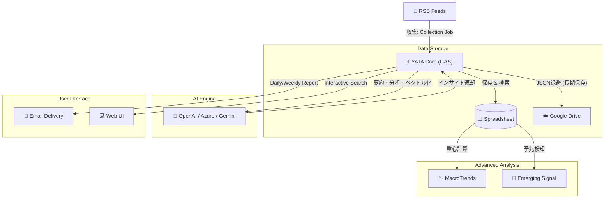

# YATA (八咫) - AI Intelligence Grimoire
> **The Three-Legged Guide to the Web.**
> **情報の海を導き、真実を映し出す。あなたのための「AIインテリジェンス・パートナー」。**

本書は、AI駆動型RSS収集・分析プラットフォーム「YATA」の全貌を記したマスターマニュアル（虎の巻）である。
システムの全体像、日々の運用、緊急時の対応までを網羅する。

---

## 🏗️ System Architecture (全体像)
YATAは「サーバーレス」かつ「ポータブル」な設計思想に基づき、Google Workspace (GAS + Sheets) 上で完結して動作する。

### 🛡️ Resilience & Optimization Strategy (堅牢化と最適化)

YATAは、不安定なWeb環境とスプレッドシートの容量制限に対応するため、以下の多層防御システムを備えています。

1.  **Dual-Layer RSS Parsing (収集の多層化)**
    *   **Level 1 (Strict)**: まず標準的な `XmlService` でパースを試みます。
    *   **Level 2 (Fallback)**: 構造エラー（閉じタグ忘れや制御文字など）で失敗した場合、自動的に**正規表現による救済モード (`RegexFallback`)** に切り替わり、タイトルとリンクを強制抽出します。

2.  **Vector Quantization (ベクトルの量子化)**
    *   AIが生成する1536次元のベクトルデータは、スプレッドシート保存時に**小数点以下6桁**に丸められます。
    *   これにより、検索精度を維持したままデータ容量を**約50%削減**し、シートの寿命を大幅に延命します。

---

## ⛩️ Concept: 三本足の導き手

名前の由来は、日本神話の「八咫烏（ヤタガラス）」と「八咫鏡（ヤタノカガミ）」。

1.  **収集 (Collection)**: 広大なWebから鮮度の高い情報を掴む足。並列処理による高速RSS巡回。
2.  **分析 (Analysis)**: 本質を見抜き、過去からの文脈を紡ぐ足。LLMによる要約と予兆検知。
3.  **伝達 (Dispatch)**: 必要な時に、必要な形（メール/Web）で届ける足。パーソナライズされたインサイト。

---

## 🚀 Key Features

### 1. インテリジェント・モニタリング

*   **重複排除 & ボット対策**: URL正規化とタイトル一致確認により重複記事を徹底排除。ランダム待機とUser-Agent偽装、ドメイン分散アクセスで安定収集。
*   **多層監視**: 技術、ビジネス、論文など、登録されたあらゆるRSSソースを24時間監視。

### 2. 予兆（サイン）検知：Emerging Signal Engine

*   **マジョリティからの乖離**: 現在のトレンド重心から数学的に離れた「異質な記事」を検出。
*   **核形成 (Nucleation)**: 異なるソースで同時に語られ始めた「小さなシグナル」を特定し、将来のトレンドを予測。

### 3. ハイブリッド検索

*   **Semantic Search (意味検索)**: ベクトル埋め込み (Embedding) により、キーワードが一致しなくても「文脈」が近い記事をヒットさせる。
*   **Advanced Query**: AND/OR/NOT やカッコを使った複雑な論理検索が可能。

### 4. パーソナライズド・レポート

*   **自動配信**: ユーザーの設定に応じ、日刊（毎朝）または週刊（指定曜日）でレポートを自動生成。
*   **コンテキスト認識**: 過去の履歴を参照し、「先週からの進展」を含めたストーリーのあるレポートを生成。

### 5. Long-term Archiving (長期トレンド保存) 【v3.3.0 New】

*   **自動アーカイブ & 軽量化**: 3ヶ月を経過したデータは自動的にJSON化してGoogle Driveへ退避。スプレッドシートを常に軽量に保つ。
*   **MacroTrends**: 生データの代わりに「その月のトレンド重心（ベクトル平均）」と「要約」を記録し、数年単位の話題変遷を追跡可能にする。

### 6. Enterprise-Grade Security 【v3.3.0 New】

*   **完全なID分離**: 記事データ（公開用）と設定データ（非公開用）を物理的に別ファイルで管理。
*   **シークレット管理**: APIキーやID類をすべてスクリプトプロパティに隠蔽。

---

## 🗓️ User Workflow (利用者の体験)

### 1. 朝のインサイト (Daily Routine)

*   **07:00 (収集)**: YATAが寝ている間に世界のニュースを収集し、重複を排除。
*   **07:30 (分析)**: AIが全記事を読み込み、「事実」だけを抽出して要約。
*   **08:00 (配信)**: あなたのメールボックスに「今日知るべきこと」だけが届く。

### 2. 深掘りと探索 (Deep Dive)

*   気になったトピックがあれば、**Web UI** にアクセス。
*   「直近1ヶ月」×「意味検索」で、関連する過去の動きを一気に洗い出す。

---

## 📖 Configuration Guide (設定マニュアル)

### 1. 検索クエリの書き方

`Keywords` シートや `Users` シートでは、以下の演算子が使用可能です。

| 検索タイプ | 記法例 | 説明 |
| :--- | :--- | :--- |
| **AND検索** | `AI 医療` | 両方の単語を含む (スペース区切り) |
| **OR検索** | `Python OR Ruby` | いずれかの単語を含む (**大文字**指定) |
| **NOT検索** | `Apple -Fruit` | Appleを含み、Fruitを**含まない** |
| **複合** | `(EV OR 電気自動車) -テスラ` | カッコで優先順位を指定可能 |

### 2. シート設定の仕様

#### 👥 Users シート (配信設定) -> [非公開ファイル]

| 列 | 項目名 | 設定値の例 | 説明 |
| :--- | :--- | :--- | :--- |
| A | Name | Boncoli | ユーザー名 |
| B | Email | user@example.com | 配信先 |
| C | Day | `月` / `(空欄)` | `空欄`=毎日、`曜日`=週1回配信 |
| D | Keywords | `AI, 半導体` | 関心キーワード(カンマ区切り) |
| E | Semantic | `TRUE` | `TRUE`でAI意味検索を有効化 |

#### 🔑 Keywords シート (定点観測) -> [非公開ファイル]

| 列 | 項目名 | 説明 |
| :--- | :--- | :--- |
| A | Query | 検索クエリを入力 |
| B | Flag | `TRUE` で有効化 |
| D | Label | レポート用短縮名 |

---

## 🛠️ Setup & Maintenance (管理者向け)

### 1. 必須環境変数 (Script Properties)

[プロジェクト設定] > [スクリプトプロパティ] に以下を設定してください。

#### 🛡️ Infrastructure

| プロパティ名 | 説明 |
| :--- | :--- |
| `DATA_SHEET_ID` | **[公開]** データ収集用シートID |
| `CONFIG_SHEET_ID` | **[非公開]** 設定管理用シートID |
| `ARCHIVE_FOLDER_ID` | **[保存先]** アーカイブ用ドライブフォルダID |
| `MAIL_TO` | 管理者メールアドレス |
| `MAIL_SENDER_NAME` | メール送信者名 (例: YATA Bot) |

#### 🧠 AI Engine

| プロパティ名 | 説明 |
| :--- | :--- |
| `EXECUTION_CONTEXT` | `COMPANY` or `PERSONAL` |
| `OPENAI_API_KEY` | Azure OpenAI Key |
| `OPENAI_API_KEY_PERSONAL` | OpenAI Key (Fallback) |
| `AZURE_ENDPOINT_URL_MINI` | Azure Endpoint (GPT-4o等) |
| `AZURE_EMBEDDING_ENDPOINT` | Azure Embedding Endpoint |

### 2. シート構成 (Sheet Structure)

ファイルの役割分担は**「事実 (Raw Data) の公開」**と**「戦略 (Intelligence) の秘匿」**に基づいています。

#### 📂 公開用ファイル (Data Sheet)
**ID**: `DATA_SHEET_ID`
純粋な情報ソースと統計データのみを配置します。

*   **`RSS`**: 収集対象フィード一覧
*   **`collect`**: 収集データ (Raw Data)
*   **`MacroTrends`**: 長期トレンドの重心記録 (Meta Data)

#### 🔒 非公開用ファイル (Config Sheet)
**ID**: `CONFIG_SHEET_ID`
組織の関心事項、ユーザー情報、AIの分析履歴など、戦略的な情報を配置します。

*   **`Users`**: ユーザー管理と配信設定
*   **`Keywords`**: 観測キーワード（ウォッチリスト）
*   **`prompt`**: LLMへの指示書
*   **`DigestHistory`**: 過去の分析履歴（前回との差分比較用）
*   **`Memo`**: 開発者用メモ

### 3. デバッグ・メンテナンスコマンド

スクリプトエディタから手動実行できる関数です。

*   **`runAllTests()`**: システム健全性の一括テスト。ロジック変更後は**必ず実行**してください。
    *   設定値、検索ロジック、スコアリング、予兆検知、**RSSパースの救済機能**を検証します。
*   **`testAllRssFeeds()`**: 全RSSフィードの接続診断。どのフィードが死んでいるか一覧表示します。
*   **`archiveAndPruneOldData()`**: 古いデータのアーカイブと削除を手動実行。

---

## ⏱️ Recommended Trigger Settings (推奨トリガー設定)

システムの安定稼働とAPIコストの最適化のため、以下のスケジュールでのトリガー設定を推奨します。

| 実行関数 | 推奨頻度 | 役割 |
| :--- | :--- | :--- |
| **`runCollectionJob`** | **1〜4時間おき** | RSSの巡回、重複排除、古いデータの自動アーカイブを実行します。 |
| **`runSummarizationJob`** | **4〜8時間おき** | 新着記事のAI要約とベクトル生成を行います。APIコストを抑える場合は回数を減らしてください。 |
| **`runEmergingSignalJob`** | **1日1回 (深夜)** | その日のトレンド重心を計算し、予兆（サイン）を検知してレポートを送信します。 |
| **`sendPersonalizedReport`** | **1日1回 (朝8時等)** | ユーザーごとの関心に基づいたパーソナライズAIレポートを配信します。 |

---

## 🚑 Troubleshooting & Limits

### トラブルシューティング

| 症状 | 対処法 |
| :--- | :--- |
| **メールが届かない** | `Apps Script`管理画面で「実行数」を確認。エラーログをチェック。 |
| **「API Error」** | APIキーの期限切れやクレジット不足を確認。プロパティを更新。 |
| **収集が止まる** | 特定のRSSがタイムアウトしている可能性。`testAllRssFeeds`で特定し無効化。 |
| **検索画面エラー** | コード修正後は必ず「新しいデプロイ」を作成し、URLを更新すること。 |

### 運用コストと制限 (目安)

*   **APIコスト**: Daily $0.05 - $0.20 (GPT-4o-miniメイン運用時)
*   **GAS制限**: 実行時間 6分/回、メール送信 100通/日 (無料版)

---

## 📜 History / Changelog

| Version | Date | Key Updates |
| :--- | :--- | :--- |
| **v3.3.1** | 2026-01-05 | **Optimization & Resilience** ベクトルデータの軽量化(小数点丸め)による容量削減、RSSパース失敗時の正規表現フォールバック実装。 |
| **v3.3.0** | 2026-01-05 | **Archiving & Security** 長期アーカイブ機能(JSON退避+重心記録)、RSS収集の安全性向上(Bot判定回避)、設定値の完全外部化(AppConfig/Properties)。 |
| **v3.2.0** | 2026-01-02 | **Logic & Config Refinement** ベクトル生成精度向上(翻訳ロジック改善)、検索クエリ優先順位修正(AND>OR)、設定値(AppConfig)の集約化。 |
| **v3.1.0** | 2025-12-29 | **Performance & Scale Update** RSS収集の並列化、レポート生成の高速化、AI意味検索のメモリ最適化。 |
| **v3.0.0** | 2025-12-27 | **Emerging Intelligence Edition** 「予兆（サイン）検知」エンジン搭載。核形成 (Nucleation) の数学的検知。 |
| **v2.5.0** | 2025-12-25 | **Semantic Search** ベクトル検索 (Embedding) 実装。ハイブリッド検索対応。 |

---

**YATA Project** - *Illuminating the unseen paths of information.*
