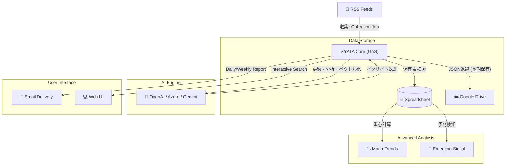

# YATA (八咫) - AI Intelligence Grimoire 🐦‍⬛🪞

> **The Three-Legged Guide to the Web.**
> **情報の海を導き、真実を映し出す。Google Apps Script (GAS) 上で完結する、あなたのための「AIインテリジェンス・パートナー」。**

本書は、完全サーバーレスで動作するAI駆動型RSS収集・分析プラットフォーム「YATA」の全貌を記したマスターマニュアルです。

### 🔰 誰でも嬉しい基本機能
* **完全自動のニュースキュレーション**: 登録したRSSから最新記事を自動収集。重複やノイズは自動で排除します。
* **AIによるサマリー生成**: 長い記事や英語の論文も、AIがサクッと日本語で要約してくれます。
* **毎朝のパーソナライズメール**: キーワードを指定しておけば、あなたの関心にドンピシャな記事だけを集めた日刊/週刊レポートが届きます。
* **サーバー代ゼロ**: GAS上で動くため、インフラ費用は無料（AIのAPI利用料のみで稼働します）。

---

## 🏗️ System Architecture (全体像)
YATAは「サーバーレス」かつ「ポータブル」な設計思想に基づき、Google Workspace (GAS + Sheets) 上で完結して動作します。

---

## 🚀 Getting Started (導入手順)

YATAをあなたの環境で動かすための手順です。

### Step 1: スプレッドシートの準備
データの保存先となるスプレッドシートを作成し、以下の名前でシートを用意します。（セキュリティの観点から「公開用(データ)」と「非公開用(設定)」の2つのファイルに分けることを推奨します）

#### 📊 1. 公開用データシート (IDを `DATA_SHEET_ID` に設定)

* **`RSS`** シート: 収集対象フィード一覧
  * 1行目: `[A列: サイト名, B列: URL]`
* **`collect`** シート: 収集データ (Raw Data)
  * **【重要】1行目に以下のヘッダーを必ず設定してください。**
  * `[A: 日付, B: サイト名, C: タイトル, D: URL, E: サマリー, F: 英語サマリー, G: Vector, H: Method Vector]`
* **`MacroTrends`** シート: 長期トレンドの重心記録用
  * `[A: 年月, B: 中心座標(Vector), C: 期間要約]`

#### 🔒 2. 非公開用設定シート (IDを `CONFIG_SHEET_ID` に設定)

* **`Users`** シート: 配信先設定
  * `[A: Name, B: Email, C: Day(空欄で毎日), D: Keywords(カンマ区切り), E: Semantic(TRUE/FALSE)]`
* **`Keywords`** シート: 観測したいキーワード設定
  * `[A: Query, B: Flag(TRUE), C: (空), D: Label(短縮名)]`
* **`prompt`** シート: LLMに渡すプロンプトテンプレート
  * `[A: キー(Key), B: プロンプト本文(Value)]`
  * ※最低限以下のキーが必要です: `BATCH_SYSTEM`, `BATCH_USER_TEMPLATE`, `TREND_SYSTEM`, `TREND_USER_TEMPLATE`
  * > **💡 プロンプトの例 (`BATCH_SYSTEM`):**
    > あなたは情報圧縮エンジンです。提供された記事からマーケティング表現を除去し、客観的事実のみを抽出してください。JSON形式 `{ "tldr": "..." }` で出力せよ。
* **`DigestHistory`** シート: AIの要約履歴記録用

### Step 2: GASプロジェクトの作成とコード配置
1. Google Driveから「Google Apps Script」の新規プロジェクトを作成します。
2. リポジトリの `lib/YATA.js` の内容を `コード.gs` に貼り付けます。
3. （必要に応じて、Web UI用の `Index.html` 等を追加します）。

### Step 3: スクリプトプロパティ（環境変数）の設定
GASエディタの [プロジェクトの設定] (歯車マーク) > [スクリプトプロパティ] に以下を設定してください。

| プロパティ名 | 説明 | 備考 |
| :--- | :--- | :--- |
| `DATA_SHEET_ID` | データ収集用シートID | 必須 |
| `CONFIG_SHEET_ID` | 設定管理用シートID | 必須 |
| `ARCHIVE_FOLDER_ID` | アーカイブ用ドライブフォルダID | 必須 |
| `MAIL_TO` | 管理者メールアドレス | エラー通知等用 |
| `MAIL_SENDER_NAME` | メール送信者名 | 例: `YATA Bot` |
| `EXECUTION_CONTEXT` | `COMPANY` or `PERSONAL` | プロンプト分岐用 |
| `OPENAI_API_KEY` | OpenAI (または Azure) の API Key | 必須 |
| `OPENAI_API_KEY_PERSONAL` | OpenAI Key (Fallback用) | 任意 |
| `AZURE_ENDPOINT_URL_MINI` | Azureを使う場合のエンドポイント | 使わない場合は未設定 |
| `AZURE_EMBEDDING_ENDPOINT` | Azure Embedding Endpoint | 使わない場合は未設定 |

> 💡 **Tip:** Azure環境を使用しない場合は、`AZURE_ENDPOINT_URL_MINI` 等を設定しなければ自動的にネイティブの OpenAI API にフォールバックします。

### Step 4: トリガー（定期実行）の設定
以下のスケジュールでのトリガー設定を推奨します。

| 実行関数 | 推奨頻度 | 役割 |
| :--- | :--- | :--- |
| **`jobDispatcher`** | **30分おき** | 時間帯（前半/後半）を判別し、収集ジョブと要約ジョブを安全に振り分けて実行します。 |
| **`runEmergingSignalJob`** | **1日1回 (深夜)** | その日のトレンド重心を計算し、予兆（サイン）を検知してレポートを送信します。 |
| **`sendPersonalizedReport`** | **1日1回 (朝8時等)** | ユーザーごとの関心に基づいたパーソナライズAIレポートを配信します。 |

---

## 📖 Configuration Guide (設定マニュアル)

### 検索クエリの書き方
`Keywords` シートや `Users` シートでは、以下の演算子が使用可能です。

| 検索タイプ | 記法例 | 説明 |
| :--- | :--- | :--- |
| **AND検索** | `AI 医療` | 両方の単語を含む (スペース区切り) |
| **OR検索** | `Python OR Ruby` | いずれかの単語を含む (**大文字**指定) |
| **NOT検索** | `Apple -Fruit` | Appleを含み、Fruitを**含まない** |
| **複合** | `(EV OR 電気自動車) -テスラ` | カッコで優先順位を指定可能 |

---

## 🧠 Under the Hood (変態的アーキテクチャの全貌)

YATAの真髄は、GAS（実行時間6分・メモリ制限・セル数制限）と、不安定なWeb環境という「過酷な制約」をハックし尽くした裏側のロジックにあります。

### 1. 極限のGASメモリ最適化 (Lazy Loading)
数万件のデータを扱う際、全件を読み込むとGASは即座にクラッシュします。YATAは**まず「日付列（A列）」だけを1次元配列として取得**して行数を特定し、必要な行数だけをメモリに展開する「スマート読み込み」を実装しています。さらに、グローバル空間にシングルトンのキャッシュオブジェクト（`_SsCache`）を構築し、シートへのアクセス遅延をゼロ化しています。

### 2. Map-Reduce型バッチ要約アルゴリズム
大量のニュースを1回のLLMリクエストに詰め込むとToken Limitを起こします。YATAは記事群をチャンク（塊）に分割して「中間要約」を並列生成し、最後にそれらを統合して「最終ダイジェスト」を生成する、堅牢なMap-Reduce型処理を採用しています。

### 3. ヒューリスティックスコアと執念の重複排除
* **指数関数的減衰スコアリング**: 記事の重要度は、単なるキーワードのヒット数だけでなく `Math.exp(-daysOld / 7)` という減衰関数（Freshness Decay）を用いてモデリングしています。
* **タイトル指紋化 (Fingerprinting)**: 記事の重複判定では、全角/半角の揺れや記号の違いを正規表現で極限まで削ぎ落とし「指紋化」することで確実に弾きます。

### 4. Native Dimensionality Reduction (256次元圧縮)
最新の Embedding モデル (`text-embedding-3-small`) のネイティブ機能を活用し、保存時のベクトルを 1536次元から **256次元** へと劇的に圧縮。精度劣化を 2% 未満に抑えつつ、保存容量（GASの1セル文字数制限）を従来の 1/6 にまで削減しました。

### 5. Method Embedding (2nd Vectorization)
「何について書かれているか（Topic）」に加えて、「どうやって測定・実験したか（Method/Modality）」という異なる軸でのベクトル化を同時に行います。これにより、異分野間で同じ手法が使われ始めたという「真の予兆（Emerging Signal）」を検知する多次元的なインテリジェンスを実現しています。

### 6. AIのポンコツ対応 & マルチLLMルーティング
* **自己修復JSONパーサー**: LLMがMarkdownのコードブロックをつけてきたり、出力が途切れてもエラーにしません。正規表現で無理やり中身を抜き出す自己修復ロジックを搭載しています。
* **自動フォールバック**: Azure OpenAI、OpenAI、Geminiを透過的に扱い、一方が死んでも自動で切り替えます（Serial Fallback）。

### 7. 記憶の永続化とステートフルリカバリ
* **連想記憶 (Associative Memory)**: 過去のレポートをベクトル化して保存。検索時にキーワードが一致しなくても、ベクトル類似度から「文脈の近い過去の履歴」を引っ張り出します。
* **動的期間リカバリ**: メールの自動送信ジョブがエラーで落ちた場合でも、次回起動時に「未送信だった日数」を自動計算して期間を拡張し、抜け漏れなくリカバリします。

### 8. 執念のスクレイピング機構 (Regex Fallback & Round-Robin)
* 同一サイトへの連続アクセスによるIPバンを防ぐための**ラウンドロビン方式**。
* XML構造が壊れているRSSに遭遇した場合、`XmlService` のエラーを検知して**即座に正規表現モードへ移行**し、タグの隙間から強引に抽出します。

---

## 🛠️ Developer & Maintenance Tools
YATAには、日々の運用保守やトラブルシューティングを楽にするための「ツール関数」が実装されています。スクリプトエディタから手動で実行してください。

* **`diagnoseRssLatency()`**: 全RSSの「応答速度」を計測し、遅延ワーストランキングを出力します（GASのタイムアウト対策）。
* **`testAllRssFeeds()`**: 全RSSの死活監視・パーステストを実行します。
* **`archiveAndPruneOldData()`**: 規定の月数を過ぎた古い記事をJSON化してDriveへ退避し、シートから削除します。
* **`toolFixEnglishSummaries()`**: AIが誤って英語で出力してしまった要約を検知し、並列処理でLLMに再要約させます。
* **`runAllTests()`**: 設定の妥当性、検索ロジック、ベクトル類似度計算などの全ユニットテストを一括実行します。

---

## 🚑 Troubleshooting & Limits

### トラブルシューティング
| 症状 | 対処法 |
| :--- | :--- |
| **メールが届かない** | `Apps Script`管理画面で「実行数」を確認。エラーログをチェック。 |
| **「API Error」** | APIキーの期限切れやクレジット不足を確認。プロパティを更新。 |
| **収集が止まる** | 特定のRSSがタイムアウトしている可能性。`testAllRssFeeds`で特定し無効化。 |
| **検索画面エラー** | コード修正後は必ず「新しいデプロイ」を作成し、URLを更新すること。 |

### 運用コストと制限 (目安)
* **APIコスト**: Daily $0.05 - $0.20 (GPT-4o-miniメイン運用時)
* **GAS制限**: 実行時間 6分/回、メール送信 100通/日 (無料版)

---

## 📜 History / Changelog

詳細な変更履歴については [CHANGELOG.md](CHANGELOG.md) をご参照ください。

---

## 🤖 AI Declaration
本プロジェクトのソースコード（`lib/YATA.js`等）およびドキュメントは、開発者（ヒト）によるアーキテクチャ設計と検証のもと、生成AI（Gemini, GPT等）をコーディング・パートナーとして活用して記述・リファクタリングされています。

## ⚖️ License
This project is licensed under the Creative Commons Attribution-NonCommercial 4.0 International License (CC BY-NC 4.0).
You are free to share and adapt the material, but you may **NOT** use it for commercial purposes.
See the [LICENSE](LICENSE) file for details.

---

**YATA Project** - *Illuminating the unseen paths of information.*
