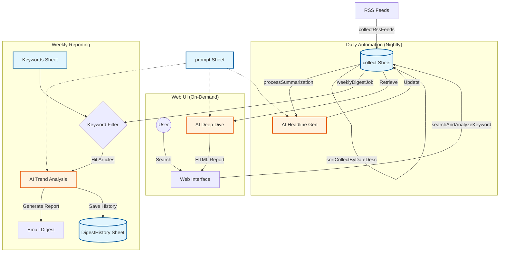

# RSS Collector & AI Intelligence Tool
> **あなた専属の「AIリサーチャー」が、情報の海から「宝石」を見つけ出します。**


## 📖 概要 (Introduction)

**RSScollect** は、単なるニュースリーダーではありません。
膨大なWeb記事を自動収集し、最先端のAI（GPT-4o, Gemini）があなたの代わりに「読み」「分析」し、「重要なインサイト」だけを届けてくれる**インテリジェンス・プラットフォーム**です。

毎朝のニュースチェックにかける時間を **90%削減** しながら、人間では見逃してしまうような**「技術の萌芽」や「トレンドの変化」**をキャッチすることができます。

---

## 🚀 活用シナリオ (Use Cases)

このツールは、情報の「鮮度」と「深度」を重視するプロフェッショナルに最適です。

### 👩‍🔬 1. 研究開発 (R&D) ・ アカデミア
*   **課題**: 毎日数百件の論文やテックブログが更新され、追いきれない。
*   **解決**: 「特定のタンパク質名」や「新技術名」を登録しておけば、AIが関連論文だけをピックアップし、**「従来技術との違い」や「新規性」**を要約してレポートします。

### 👨‍💼 2. 経営企画 ・ マーケティング
*   **課題**: 競合他社の動きや、市場のトレンド変化を定点観測したい。
*   **解決**: 毎週月曜日に「競合X社」の動向レポートが届きます。先週と比較して**「活動が活発化した」「ネガティブな報道が増えた」**といった文脈（Context）もAIが分析します。

### 👨‍💻 3. エンジニア ・ テックリード
*   **課題**: 新しいライブラリやフレームワークのキャッチアップが大変。
*   **解決**: Web UIで「React Server Components」と検索すれば、**直近1ヶ月のベストプラクティス記事**だけをAIが厳選し、技術要点だけをまとめたHTMLレポートを即座に生成します。

---

## 💡 特徴と提供価値 (Key Features)

### 1. 「点」ではなく「線」を見る（Trend Tracking）
過去の分析結果をシステムが記憶しています。
「先週は話題だったが、今週は沈静化した」「解決策としての新技術が登場した」など、**時間軸でのストーリー**をAIが語ります。

### 2. 「今」を知るスポット分析（Deep Dive）
会議の直前でも大丈夫。Web UIからキーワードを入力するだけで、直近の記事60件（約1ヶ月分）をAIが総ざらいし、**「今、何が起きているか」**を構造化してレポートします。
`AND`検索（例: `AI 創薬`）や `OR`検索（例: `がん or 腫瘍`）にも対応し、柔軟な深掘りが可能です。

### 3. ストレスフリーな運用
*   **完全自動化**: 収集、要約、配信、そして古いデータの削除まで、すべて全自動で動作します。
*   **スマートな配信**: 記事が多い日は自動で要約を分割処理。メール配信も「毎週月曜」「平日のみ」など、キーワードごとに細かく指定可能です。

---

## 🛠️ 技術仕様 (Technical Specifications)

エンジニア向けのアーキテクチャ詳細です。
本システムは **Google Apps Script (GAS)** を基盤とし、**堅牢性**と**メンテナンス性**を重視して設計されています。

### 1. システム・アーキテクチャ



### 2. プロジェクト構造

```text
RSScollect/
├── Index.html           # Web UI (検索インターフェース)
├── RSScollect.js        # コアロジック (収集, AI分析, メール配信)
├── README.md            # ドキュメント
└── ...
```

### 3. コアテクノロジー & 実装詳細

#### マルチティア・LLMフォールバック
API障害やレート制限による停止を防ぐため、3段階のフォールバックシステム（`LlmService`）を実装しています。
1.  **Azure OpenAI**: エンタープライズグレードの安定性とセキュリティ（Primary）。
2.  **OpenAI API**: Azure障害時のバックアップ（Secondary）。
3.  **Google Gemini**: 上記すべてが利用不可な場合の最終防衛ライン（Tertiary）。

#### 堅牢なRSS収集エンジン
*   **全フォーマット対応**: RSS 1.0 (RDF), 2.0, Atom形式を自動判別してパース。
*   **自己修復機能**: XMLパースエラー発生時、制御文字や不正なタグを自動除去して再試行する強力なサニタイズ処理を搭載。
*   **Web互換性**: 一般的なブラウザ（User-Agent）を偽装し、Bot対策されたフィードも収集可能です。

### 4. 安全・堅牢な設計 (Reliability & Security)
長期間の無人運用を想定し、以下の保護機能を備えています。
*   **タイムアウト・セーフティバルブ**: GASの6分制限を監視。キーワードが多い場合でも、制限時間内に処理できた分だけでレポートを生成・送信し、処理の全ロスを防ぎます。
*   **HTMLサニタイザー**: LLMの出力から危険なタグ（script, iframe等）を自動除去。Web UI上でのXSS（クロスサイトスクリプティング）攻撃を防止します。
*   **ロバストJSONパース**: LLMレスポンスに含まれる不要なMarkdown記号やゴミを自動修復してJSONを抽出。リトライ上限付きで無限ループを防止します。

### 5. 主要関数リファレンス

| 関数名 | 役割・ロジック概要 | 依存シート |
|---|---|---|
| `collectRssFeeds` | RSS/Atomフィードを巡回・パースし、重複を除外してDBに追記。 | `RSS`, `collect` |
| `processSummarization` | 記事の「見出し」をAI生成。短い記事はルールベースで処理し、APIコストを抑制。 | `collect`, `prompt` |
| `weeklyDigestJob` | キーワードに基づくトレンド分析レポートを作成しメール配信。履歴との差分比較も行う。 | `Keywords`, `DigestHistory` |
| `searchAndAnalyzeKeyword` | **Web UI用**。指定キーワードでDBを検索し、直近記事をAI分析してHTMLを返す。 | `collect`, `prompt` |
| `sanitizeHtmlForWeb` | LLMからの出力をサニタイズし、Web表示の安全性を確保する。 | (Utility) |
| `LlmService` (Module) | Azure/OpenAI/Geminiの切り替えを行う通信レイヤー。エラーハンドリングを一元管理。 | (Script Properties) |

---

## ⚙️ セットアップ手順 (Setup)

### 1. スプレッドシートの準備
以下の6つのシートを持つGoogleスプレッドシートを作成します。

| シート名 | 目的 |
|---|---|
| `RSS` | 収集対象のRSSフィードURL一覧。 |
| `collect` | 収集した全記事データ（データベース）。 |
| `Keywords`| 週刊レポートの観測対象キーワード（配信曜日の指定も可能）。 |
| `prompt` | AIへの指示（プロンプト）テンプレート。 |
| `DigestHistory` | 週ごとの分析結果を蓄積し、次週の比較に使用。 |
| `Users` | メール配信先ユーザー管理（有効/無効設定）。 |

### 2. スクリプトプロパティの設定
「プロジェクトの設定」>「スクリプト プロパティ」に以下を設定します。

| プロパティ名 | デフォルト値 | 説明 |
|---|---|---|
| `DIGEST_TOP_N` | `20` | 週刊メールの1キーワードあたりの分析対象数。 |
| `DIGEST_DAYS` | `7` | 週刊レポートの集計期間。 |
| `OPENAI_MODEL_MINI` | `gpt-4.1-mini` | 分析・要約用モデル（Azure/OpenAI）。 |
| `OPENAI_MODEL_NANO` | `gpt-4.1-nano` | 見出し生成用軽量モデル。 |
| `EXECUTION_CONTEXT` | `COMPANY` | `COMPANY` (Azure優先) または `PERSONAL` (OpenAI優先)。 |

※ APIキー類（`OPENAI_API_KEY`, `AZURE_ENDPOINT...`, `GEMINI_API_KEY` 等）も適切に設定してください。

### 3. トリガーの設定（推奨運用フロー）

| 関数名 | イベント | タイマー設定 | 目的 |
|---|---|---|---|
| `mainAutomationFlow` | 時間主導 | 毎日 1:00〜2:00 | RSS収集・AI見出し生成・並び替え（必須） |
| `weeklyDigestJob` | 時間主導 | 毎週 月曜 9:00〜10:00 | 週刊トレンドレポート配信 |
| `maintenanceDeleteOldArticles` | 時間主導 | 毎週 日曜 3:00〜4:00 | 古いデータの自動削除 |

---

## 🤝 Contribution
Bug reports and pull requests are welcome on GitHub at https://github.com/Boncoli/RSScollect.