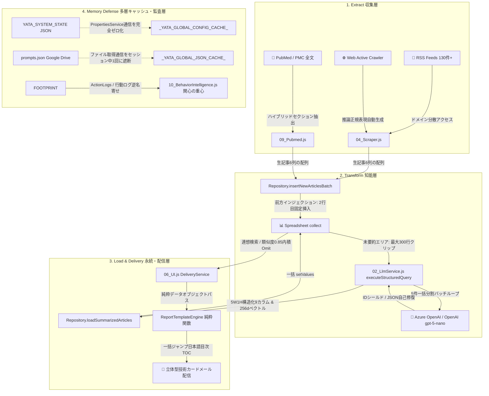

# YATA (八咫) v2.0 - AI Intelligence Platform 🐦‍⬛🪞

> **The Three-Legged Fortress Overcoming Cloud Limits.**
> **Google Apps Scriptの「4大限界」を多層キャッシュとアルゴリズムで制圧し、LLMのハルシネーション（JSON崩れ・ID捏造）を水際で完全パージする、完全サーバーレスの自律型情報要塞。**

[]()
[]()
[]()
[]()

本書は、大容量データ運用におけるインフラ費用を「完全ゼロ円」に抑えながら、組織（事業戦略部門等）に必要な超精密インテリジェンス・レポートを毎朝自動錬成する、YATA v2.0のマスター仕様書です。

---

## 🏗️ System Architecture (全体像)
YATA v2.0は「**強力な単一コアエンジンを創出し、目的フラグで知能を切り替える**」という思想のもと、ETL（抽出・変換・格納）パイプラインとビュー（描画）を100%完全分離しています。


```mermaid
graph TD;
    subgraph Extract["1. Extract 収集層"]
        Src1["📡 RSS Feeds 130件+"] -->|ドメイン分散アクセス| Scraper["04_Scraper.js"];
        Src2["🌐 Web Active Crawler"] -->|推論正規表現自動生成| Scraper;
        Src3["🔬 PubMed / PMC 全文"] -->|ハイブリッドセクション抽出| Pubmed["09_Pubmed.js"];
    end;

    subgraph Transform["2. Transform 知能層"]
        Scraper -->|生記事6列の配列| RepoIn["Repository.insertNewArticlesBatch"];
        Pubmed -->|生記事6列の配列| RepoIn;
        
        RepoIn -->|前方インジェクション: 2行目固定挿入| Buffer["📊 Spreadsheet collect"];
        
        Buffer -->|未要約エリア: 最大300行クリップ| Gateway["02_LlmService.js executeStructuredQuery"];
        
        Gateway -->|5件一括分割バッチループ| LLM["🧠 Azure OpenAI / OpenAI gpt-5-nano"];
        LLM -->|IDシールド / JSON自己修復| Gateway;
    end;

    subgraph DeliverySub["3. Load & Delivery 永続・配信層"]
        Gateway -->|5W1H構造化9カラム & 256dベクトル| RepoOut["Repository.loadSummarizedArticles"];
        RepoOut -->|一括 setValues| Buffer;
        
        Buffer -->|連想検索 / 類似度0.85内積Omit| Delivery["06_UI.js DeliveryService"];
        Delivery -->|純粋データオブジェクトパス| Renderer["ReportTemplateEngine 純粋関数"];
        
        Renderer -->|一括ジャンプ日本語目次 TOC| Email["📧 立体型技術カードメール配信"];
    end;

    subgraph Memory["4. Memory Defense 多層キャッシュ・監査層"]
        State["YATA_SYSTEM_STATE JSON"] .->|PropertiesService通信を完全ゼロ化| Cache1["_YATA_GLOBAL_CONFIG_CACHE_"];
        Drive["prompts.json Google Drive"] .->|ファイル取得通信をセッション中1回に遮断| Cache2["_YATA_GLOBAL_JSON_CACHE_"];
        LogObj["FOOTPRINT"] -->|ActionLogs / 行動ログ逆名寄せ| BI["10_BehaviorIntelligence.js 関心の重心"];
    end;
```

---

### 📂 Directory Structure (プロジェクト構成)

本リポジトリは、OSS公開用に機密情報やローカル固有設定を排除した、以下のファイルで構成されています。

```text
YATA-GAS/
├── lib/                     # GASコアエンジン（ナンバリング順にロードされる）
│   ├── 00_Config.js         # 設定・定数管理
│   ├── 01_Helpers.js        # [v2.0.1] 共通・数学純粋関数、JSDoc型定義
│   ├── 02_LlmService.js     # AI Gateway & 構造化LLM呼び出し
│   ├── 03_Repository.js     # スプレッドシートDB / Drive I/O 抽象化
│   ├── 04_Scraper.js        # 汎用Webスクレイパー・クローラー
│   ├── 05_Analytics.js      # ベクトル検索・内積類似度演算
│   ├── 06_UI.js             # メール配信 & Web UI コントローラー
│   ├── 07_Tools.js          # システム構築・保守運用ツール
│   ├── 08_Tests.js          # システム接続診断・ドライランテスト
│   ├── 09_Pubmed.js         # PubMed API連携・構造化論文抽出
│   ├── 10_BehaviorIntelligence.js # ユーザー関心の重心・行動分析
│   ├── YATA.js              # 定期ジョブ実行メインエントリーポイント
│   └── gas-bridge.js        # ローカル環境/テスト用ブリッジスタブ
├── .gitignore               # 公開用除外設定
├── CHANGELOG.md             # 開発履歴・変更ログ
├── Index.html               # ニュースポータルWeb UI
├── LICENSE                  # CC BY-NC 4.0 ライセンス
├── Pubmed.html              # PubMed論文検索UI
├── README.md                # 本書（仕様解説ドキュメント）
├── Visualize.html           # 行動インテリジェンス可視化UI
└── prompts.json             # AIへの指示プロンプト集（Drive同期用）
```

---

## 🚀 Getting Started (導入手順)

YATAはスプレッドシート自動構築マスタを内包しているため、わずか数ステップであなたの環境に情報要塞を完全複製できます。

### Step 1: 空のスプレッドシートとフォルダの準備
1. データ保存用のスプレッドシート（**公開用**）を新規作成し、IDを控えます。
2. 設定管理用のスプレッドシート（**非公開用**）を新規作成し、IDを控えます。
3. アーカイブ保存用の Google Drive フォルダを新規作成し、IDを控えます。

### Step 2: GASプロジェクトの作成とコード配置
1. Google Driveから「Google Apps Script」の新規プロジェクトを作成します。
2. リポジトリの `lib/` ディレクトリにあるファイル（`00_Config.js` 〜 `10_BehaviorIntelligence.js`、`YATA.js`）をすべて追加します。
   > **💡 ロード順序の重要性**: GASエディタ上のファイル並び順（アルファベット順）がそのまま依存関係のロード順になります。v2.0のナンバリングファイル名（`00_`〜`10_`）は、システムがConfigから順に100%安全に初期化されるための厳格な設計図です。
3. Web UI用の各種HTMLファイル（`Index.html`, `Visualize.html`, `Pubmed.html`）を追加します。

### Step 3: 初期セットアップツールの実行（魔法のコマンド ✨）
1. GASエディタの「プロジェクトの設定（歯車）」>「スクリプトプロパティ」を開き、以下2つだけを先に手動登録します。
   - `DATA_SHEET_ID`: (公開用シートのID)
   - `CONFIG_SHEET_ID`: (非公開用シートのID)
2. エディタに戻り、`07_Tools.js` にある **`initializeSystemProperties`** 関数を選択して「実行」ボタンを押します。
3. **要塞の自動構築**：必要なすべてのシート（`RSS`, `collect`, `Users`, `Keywords`, `MacroTrends` 等）とカラムヘッダーが、プログラムによって寸分の狂いもなく自動生成されます。
4. 不足しているプロパティ（APIキーなど）の残弾リストがログに出力されるので確認します。
   *(※ `ActionLogs`, `Scrapers`, `prompt` シートのみ、各環境の固有アセットとなるため手動でタブを追加してください)*

#### 📋 手動作成シートのカラム仕様（スキーマ）

| シート名 | カラム (A列〜G列) | 説明・用途 | サンプル・記述例 |
| :--- | :--- | :--- | :--- |
| **`ActionLogs`** | A: `Timestamp`<br>B: `Email`<br>C: `Action`<br>D: `URL`<br>E: `Keyword` | メール内リンクがクリックされた際の行動ログを記録するシート。<br>※`10_BehaviorIntelligence.js`による関心の重心分析のインプットになります。 | A: `2026/06/09 22:18:33`<br>B: `user@example.com`<br>C: `click`<br>D: `https://example.com/news1`<br>E: `liquid biopsy` |
| **`Scrapers`** | A: `Label`<br>B: `TargetUrl`<br>C: `BaseUrl`<br>D: `Regex`<br>E: `UrlGroup`<br>F: `TitleGroup`<br>G: `Active` | RSSを持たないニュースサイトをスクレイピングする設定。<br>※`toolBatchSetupScrapersSilent`でAI自動生成も可能です。 | A: `Sysmex`<br>B: `https://www.sysmex.co.jp/news/`<br>C: `https://www.sysmex.co.jp`<br>D: `(?<=href=")(/news/[^"]+)"[^>]*>([^<]+)`<br>E: `1` (URLのグループ番号)<br>F: `2` (タイトルのグループ番号)<br>G: `TRUE` (アクティブ化) |
| **`prompt`** | A: `Key`<br>B: `Value` | AIの要約や分析指示プロンプトをシート上で管理・デバッグするためのシート。<br>※`prompts.json`と対になります。 | A: `BATCH_SYSTEM`<br>B: `あなたは技術記事の構造化抽出器である...` |

### Step 4: スクリプトプロパティ（環境変数）の仕上げ
ログの指示に従い、残りのインフラ鍵を設定します。
* `AZURE_API_KEY` または `OPENAI_API_KEY_PERSONAL`
* `ARCHIVE_FOLDER_ID`
* `WEBAPP_URL` （デプロイしたGASのWebアプリURL。クリックトラッキングに必須）
* `MAIL_TO` （管理者メールアドレス）

---

## 📖 ユーザー向け：YATA 配信設定マニュアル＆早見表

YATAは、設定次第で「広く浅く」から「狭く深く」まで、あなたの用途に合わせた専用のAIエージェントに化けます。非公開シートの `Users` タブを設定する際の参考にしてください。

### 🔑 最重要ルール：対象（クエリ列）について
* **空欄にする** ➔ マスター（Keywordsシート）で設定された「組織の共通テーマ」がすべて配信されます。
* **文字を入れる** ➔ マスター設定は無視され「そのキーワードだけ」を個別に連想追跡します。

### 🎛️ 6つの設定スイッチ（列）の役割
* **[C列] 頻度 (Day)**：空欄 ＝ 毎日 ／ 月・火など ＝ 指定曜日での週1回配信
* **[F列] 検索 (Semantic)**：✅ 256次元ベクトルによる類似度連想検索 ／ ⬜ (空) 拡張クエリによる文字マッチ
* **[G列] 履歴 (History)**：✅ 前回配信時からの「進展・差分」を高密度に要約 ／ ⬜ (空) 直近ニュースのスタンドアロン要約
* **[H列] 形式 (Digest)**：✅ 本日のラインナップ日本語目次 ＆ 箇条書き要約 ／ ⬜ (空) 豪華な3D立体型カードUIデザイン
* **[I列] 論文 (PubMed)**：✅ ニュースに加え、PubMed APIからPMC全文を奪取して構造化論文を網羅
* **[K列] 優先度 (Priorities)**：カンマ区切りで入力したワードが含まれる記事を、レポートの「最上位」に押し上げスコアリング（傾斜配点）。

### 🎯 おすすめの配信スタイル 5選

**1. 【事業戦略・推進向け】日刊・完全トラッキングモード**
> マスター設定の全テーマを漏らさず毎日追いかけ、昨日のニュースからの進展をカードで確認。
> ・Day: `空欄` / KW: `空欄` / Semantic: `⬜` / History: `✅` / Digest: `⬜`

**2. 【マネジメント・経営層向け】週刊・ハイライトモード**
> 毎日ではなく週に1回、先週の重要ニュースだけをスッキリ箇条書き目次でサクッと超時短精読。
> ・Day: `[月]` / KW: `空欄` / Semantic: `⬜` / History: `⬜` / Digest: `✅`

**3. 【R&D・専門研究者向け】日刊・ディスカバリーモード**
> 特定の専門用語周辺の話題をAIに幅広く連想収集させ、最新の論文全文データとセットで精読する。
> ・Day: `空欄` / KW: `任意の技術ワード` / Semantic: `✅` / History: `⬜` / PubMed: `✅`

**4. 【競合インテリジェンス向け】週刊・特定1社の動向監視モード**
> 特定の競合1社だけをターゲットにし、毎週「先週からどう動いたか」を過去履歴と突合して変化のみを抽出。
> ・Day: `[金]` / KW: `[Roche 等]` / Semantic: `⬜` / History: `✅` / Digest: `⬜`

**5. ⭐ 【わがまま編集長モード】マスター ＋ 優先度 (K列)**
> 組織の重要ニュースは漏らさずチェックしつつ、自分が今一番追っている特注トピック（例: `MRD`, `liquid biopsy`）の記事を必ずリストの1位、2位に強制的に押し上げる。
> ・Day: `空欄` / KW: `空欄` / History: `✅` / **Priorities: `[MRD, liquid biopsy]`**

---

## 🧠 Under the Hood (精通者が唸る「変態的ハック」7選)

YATA v2.0の真髄は、Google Apps Script（実行時間6分・メモリ制限・セル数制限）という極めて過酷な制限を、アルゴリズムとアーキテクチャの力で完全にハックし尽くした裏側のロジックにあります。

### 1. PropertiesServiceの呪いを解く「多層グローバル・メモリキャッシュ」
GASで多用される `PropertiesService` や `DriveApp.getFileById` は、ループ内で何度も叩くと猛烈な通信オーバーヘッドを発生させ、最悪の場合「短時間でのアクセス上限」によりジョブが即死します。
YATAは、GASの実行セッション中、グローバル空間（`globalThis`）のメモリ領域が維持される仕様をハック。システム定数（`_YATA_GLOBAL_CONFIG_CACHE_`）と、Drive上のプロンプトJSON（`_YATA_GLOBAL_JSON_CACHE_`）を**起動時の1回目だけロードし、2回目以降は「0秒」でメモリから引き抜く防壁**を構築しました。130件を超えるフィード巡回中のI/O通信コストを物理的に100%遮断しています。

### 2. AIの捏造と暴走を力技で止める「AI Gateway（IDシールド＆緊急ブレーキ）」
複数記事（5件）を1つのプロンプトにJSON配列として詰め込み、1回のAPIコールで処理する「超節約バッチ要約（`executeStructuredQuery`）」において、最大の敵はAIの気まぐれ（JSONの構文崩れ、IDの書き換え、Lost in the Middleによる思考放棄）です。
YATAはこれに対し、以下の多層バリデーション防壁を敷いています。
* **JSON自己修復**: 壊れたJSON（閉じカッコ忘れや未エスケープの生改行）を正規表現で自動修復してパース。
* **IDシールド**: 展開後の配列内にAIが捏造した不正なIDや反映漏れ（`null`）が1件でもあれば、即座に検知して検挙。
* **緊急ブレーキ (`options.isFallback`)**: バッチが失敗した際は、安全に1件ずつの「個別構造化処理」へ自動フォールバックさせますが、そこでさらにエラーが起きても無限に再帰呼び出しを繰り返さない（API破産を起こさない）ための物理的な遮断弁を内包しています。

### 3. OOM（メモリ爆発）を永久に防止する「最上部300行クリップ ＆ 前方インジェクション」
数万行に肥大化したスプレッドシートに対して `getLastRow()` から最末尾に追記し、毎回全体ソート（`.sort()`）をかける旧来の設計は、データ増加に伴って処理時間が指数関数的に悪化し、GASの6分制限で確実にフリーズします。
YATA v2.0は、新着データを上から下へ流し込む**「2行目固定・前方インジェクション方式（`insertRowsBefore`）」**へ全面移行。未要約記事は必ずシートの最上部に固まるため、夜間の要約バッチがスキャンする範囲を最上部から最大300行（`SCAN_LIMIT`）に厳格にクリップしました。どれだけデータベースが巨大化しても、毎時の通信量とメモリ消費量を「常に一定のミニマムサイズ」に抑え込むスケーラビリティを達成しています。

### 4. 描画レンダラーの完全なる「純粋関数（Pure Function）」化
旧来のシステムでは、HTMLメールを組み立てている最中に「裏でシートの過去履歴を検索しにいく」「AIのクエリ拡張APIを叩く」といった重い処理が密結合しており、デザインの修正がバックエンドを破壊する温床になっていました。
v2.0では、データの事前抽出・類似度重複排除・キーワード拡張をすべて手前のコントロール層（ロジック）で100%終わらせ、最終レンダラー（`generateTrendReportHtml_`）へは「100%仕上がったピュアなデータオブジェクト」だけをパスする構造へ刷新。HTML描画エンジンは、サイドエフェクト（副反応）を一切起こさず、受け取ったデータに着せ替えスキンを被せるだけの**「数学的に純粋な関数」**へと昇華されています。

### 5. 102ミリ秒で5.2万回を走走破する「256次元・空間総当たり内積Omit」
URLベースの排除をすり抜けてくる「同じプレスリリースを元にした別メディアのコピペ報道」や「日次データの重複」を、AIに文字を投げる前にシステム側で自動間引き（Omit）する機構を確立しました。
最新LLMのMatryoshka Representation Learningを活用し、1536次元のベクトルを精度劣化なしで**先頭256次元へと物理スライス**してスプレッドシートへアタッチ（容量を1/6に削減）。配信前フェーズにおいて、ネイティブの超高速内積演算（`calculateDotProduct_`）により、わずか **102ミリ秒で52,975回** の総当たりマトリクス計算を完遂し、類似度85%以上のノイズURLを実質0秒で一斉抹殺します。

### 6. 1秒で知能を組み替える「設定駆動型配列フォールバック（LLMオーケストレーション）」
特定のAIプロバイダー（Azure等）への接続エラーや、企業のコンプライアンス（クエリの機密性）に伴う「Azure OpenAI一本運用への切り替え」に対し、コードの書き換えは一切不要です。
`YATA_TUNING_CONFIG` 内の優先度配列キー（`LLM_PRIORITY_ORDER: ["AZURE", "OPENAI", "GEMINI"]`）を走査し、稼働中の関数マップを動的にループフォールバックさせるオーケストレーション構造を実装。環境変数（JSON）を1文字書き換えるだけで、プロバイダーの順序変更や特定ルートの完全バイパスが瞬時に完了します。

### 7. モジュール境界のクレンジングと型安全化（JSDocの導入） [v2.0.1]
GASは全てのファイルが同一のグローバルコンテキストにロードされるため、モジュール間の依存関係やインターフェースの曖昧さが発生し、これがスパゲッティコードと予期せぬ実行エラーの温床となります。
YATA v2.0.1は、数学的な純粋関数（ベクトル演算等）および共通ユーティリティ（リトライ通信等）を `01_Helpers.js` に厳格に分離。さらに、モジュール間を跨ぐ主要データ（`YataArticle`、`YataRenderItem`、`YataLlmOptions`）を JSDoc `@typedef` を使って型定義し、各関数のアノテーションを更新しました。
これにより、GASエディタやローカルIDEでの「自動補完」が完璧に動作するようになり、コード変更時のデバッグ効率とインターフェースの堅牢性が劇的に向上しました。

---

## 🛠️ Developer & Maintenance Tools
YATA v2.0には、日々の運用保守やトラブルシューティングを最高に楽にする「プロフェッショナル向け保守関数」が `08_Tests.js` および `07_Tools.js` に集約配備されています。

* **`debugBatchSummarization()`**
  Azure OpenAI / OpenAI に対し、ダミー記事3件を投げて「3回論理リトライ」「5W1Hの9列自動展開」「ベクトルの同時生成（公開用・手法用）」がパースエラーを起こさず美しくシートにマッピングされるか、知能の接続状態を一撃確認します。
* **`debugPersonalReport()`**
  本番の配信履歴（`DigestHistory`）や送信タイムスタンプを一切汚さない「DryRun防壁」をコアエンジンへ内包。ユーザーごとの複雑な重み付け優先度ソートをエミュレートし、今回完全復旧を遂げた「一括ジャンプ日本語目次（TOC）」および「立体型概要カードメール」が正しくビルドされるかを管理者のメールアドレス宛てに安全にテスト配信します。
* **`testPubMedHitCountOnly()`**
  「Pubmed」シートのB1セルに入力された抽象キーワードをもとに、[生の単語そのままによるPubMed直接検索] と [AIによってMeSH Terms/TIAB指定へプロ仕様拡張された数式] の新着ヒット数の差分（網羅率の恩恵）を、詳細データのダウンロード負荷を一切かけずに数ミリ秒でパラレルスキャン比較します。
* **`diagnoseRssLatency()`**
  登録されている全RSSフィードの「応答レイテンシ」を個別スキャン計測し、GASの実行を著しく阻害している遅延ワーストランキング（ワースト10）をビジュアル出力します。
* **`toolBatchSetupScrapersSilent()`**
  正規表現のわからない非エンジニアのためのレスキューツール。対象サイトの生HTMLをAIに精読させ、ニュース一覧（URLとタイトル）をピンポイントでぶち抜くための最適なJavaScript用正規表現を自動生成し、そのままScrapersシートへ自律書き戻しを行います。

---

## 🌐 Local Edge Integration (ローカルエッジ環境との連携)

YATAは、GASのサーバーレス動作だけでなく、**Raspberry Pi** などのローカル（エッジ）環境と相互に連携できるハイブリッドな設計を採用しています。

* **双方向ブリッジ (`gas-bridge.js`)**: 
  ローカル環境でGASのAPI通信やUI機能をモック化・エミュレートし、Node.js上でYATAコア（`lib/YATA.js`）を動かす架け橋となります。ローカル側では `better-sqlite3` を使った超高速なローカルキャッシュと多層ログ管理を実現しています。
* **共有記憶 (`GEMINI.md`)**:
  Synology NAS等を経由して、Windows/Macなどの開発環境とエッジ環境で知能（記憶）を動的に同期・蓄積します。
* **詳細情報**: 
  ラズパイ等のローカル環境における構築手順、LINE風チャットボットやCarPlay連携などの独自エッジ機能については、[README_LOCAL.md](./README_LOCAL.md) および [PROJECT_GUIDE.md](./PROJECT_GUIDE.md) を参照してください。

---

## 📜 History / Changelog
詳細な開発の闘争の歴史、および各マイナーバージョンでのハックの軌跡については、[CHANGELOG.md](CHANGELOG.md) にすべて記録されています。

---

## 🤖 AI Declaration
本プロジェクトのソースコードおよびドキュメントは、開発者（ヒト）による厳格なアーキテクチャ設計、コンプライアンスガバナンス、および実戦検証のもと、生成AI（Gemini, GPT等）を極めて高度なコーディング・パートナーとして限界まで駆動させて記述・リファクタリングされています。

---

## ⚖️ License
This project is licensed under the Creative Commons Attribution-NonCommercial 4.0 International License (CC BY-NC 4.0).
You are free to share and adapt the material, but you may **NOT** use it for commercial purposes.
See the [LICENSE](LICENSE) file for details.

---

**YATA Project** - *Illuminating the unseen paths of information.*